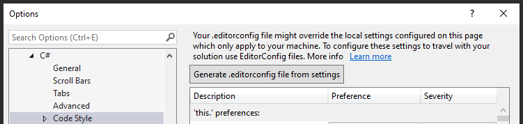
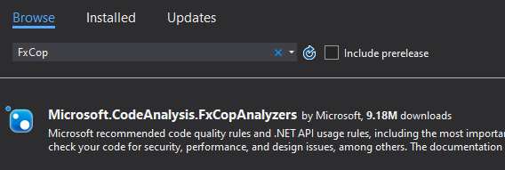
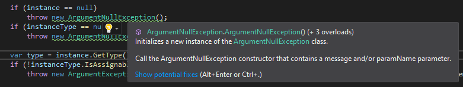
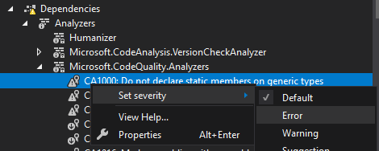
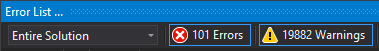
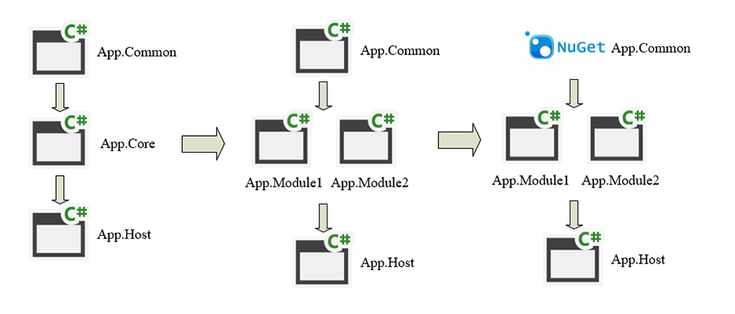
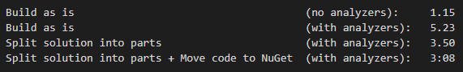

# Как с помощью статических анализаторов кода на основе Roslyn повысить качество разработки
Здравствуйте! Меня зовут Антон Широких, я full-stack-разработчик и сейчас занимаю позицию Tech Lead в компании Beetroot.

В этой статье мы рассмотрим статические анализаторы, задачи, которые они могут выполнять, пошаговое руководство по их внедрению на базе Roslyn и конфигурации, а также подводные камни, которые могут вас ждать.

Цели статьи: рассказать о статических анализаторах для языка C# на платформе Roslyn и о том, как и с какой целью их можно использовать, а также о некоторых нюансах и возможных проблемах.

Статья, на мой взгляд, может быть интересна всем C#-разработчикам, а вопросы внедрения и конфигурации — разработчикам на lead-позициях.

## Вступление
Большинство разработчиков при описании идеального проекта обычно упоминают 3 пункта: юнит-тесты, CI/CD и статические анализаторы. Если первые 2 пункта присутствуют во многих современных проектах, а также существует масса вводных статей и мануалов по этим темам, то статические анализаторы в знакомых мне проектах применяются довольно редко и вводных статей на эту тему очень немного. Моя цель — создание вводной статьи, которая бы описывала, что такое статические анализаторы в целом, какие есть возможные варианты для C#, а также простые шаги внедрения Roslyn-анализаторов в ваш проект и возможные проблемы, которые могут при этом возникнуть.

## Эволюция процесса ревью кода
Начать хотелось бы с небольшой ретроспективы относительно того, как в моей карьере появился и эволюционировал процесс ревью кода.

Началось все, наверное, как и у многих, с его отсутствия. Будучи студентом, я просто писал код в свое удовольствие, время от времени полностью переписывая тот или иной кусок, который на подсознательном уровне переставал мне нравиться (обычно это означало, что он становился абсолютно нечитаемым).

Затем на моей первой работе код стал тщательно проверяться (Тимофей, если ты это читаешь, большой тебе привет!). Тогда же под влиянием коллег у меня появились какие-то зачатки понимания того, что же такое хороший код, и желание этому пониманию соответствовать.

Впоследствии я попал в компанию с командой разработки, в которой был более-менее налаженный процесс code review на основе изменений с помощью pull-реквестов на GitHub (change-based code review).

Со временем я стал исполнять роль не только автора кода, но и ревьюера на постоянной основе, что заставило меня довольно серьезно подойти к выработке для себя стандартов хорошего кода на основе общепринятых (SOLID, KISS, рекомендации по коду от Microsoft).

## Человеческий фактор при проверке кода
Со временем, когда процесс ревью кода стал занимать стабильно большую часть времени, я начал замечать некоторые закономерности. Например, у нас было довольно много одинаковых или очень похожих комментариев, повторяющихся во многих pull-реквестах. Большинство из них относилось к правилам именования, проверкам на null, размерам методов и классов, форматированию и другим аспектам, которые не были связаны напрямую с функционалом или бизнес-логикой, но несоблюдение которых делало процесс ревью бизнес-логики более сложным и, следовательно, менее эффективным.

Также, к сожалению, не редкостью стали и pull-реквесты в несколько тысяч строк кода. При таком объеме кода даже несколько ревьюеров неизбежно могут пропустить, например, отсутствующую проверку на null, которая впоследствии может привести к неприятным NullReferenceException. Когда я приступаю к таким pull-реквестам, я всегда беспокоюсь, что могу что-то пропустить, и даже тот факт, что ревью таких pull-реквестов обычно проходит в несколько этапов, все равно не добавляет уверенности. Потому что все мы люди и можем совершать ошибки.

## Статический анализ кода?
Понимая, что наш процесс код-ревью, мягко говоря, неидеален, мы с командой провели несколько митингов, на которых каждый озвучивал актуальные для себя проблемы и мы вместе думали и предлагали возможные решения. Мой коллега предложил в качестве решения введение статических анализаторов кода, чтобы обнаруживать ошибки еще до создания pull-реквеста. Идея всем понравилась, и при поверхностном анализе возможных решений было очевидно, что тут скрыт огромный потенциал по улучшению не только процесса код-ревью, но и по значительному повышению общего качества кода.

## Подготовительный этап
В первую очередь необходимо разобраться, что же такое статические анализаторы кода, какими они бывают, для чего чаще всего используются и какие еще функции могут потенциально выполнять.

Статический анализатор кода — это ПО, которое проводит анализ программы без ее выполнения. Инструменты статического анализа проводят более глубокую проверку исходного кода, чем это делает компилятор, который обычно находит только синтаксические ошибки.

Статические анализаторы применяются для значительно более широкого спектра задач, чем те, что мы ставили в рамках нашей команды. Отдельно хотелось бы отметить, что статические анализаторы бывают разные. На основе материалов, которые я успел изучить, можно выделить следующие наиболее распространенные задачи, выполняемые статическим анализатором кода:
1. Поиск ошибок в программе без необходимости ее выполнения.
2. Улучшение качества кода в широком смысле этого слова. Качество исходного кода — это комплексное понятие, которое включает в себя, кроме прочего, количество ошибок на условные 100 строк кода. Но также в это понятие входят читаемость, поддерживаемость, сложность кода (cyclomatic complexity), уровень связанности и другие аспекты, которые прямо или косвенно влияют на количество ошибок, а также на общее время разработки.
3. Сбор метрик проекта, сбор статистики, построение графиков и диаграмм, отражающих общее «состояние здоровья» проекта. Пример анализаторов такого типа — NDepend. Также в Visual Studio присутствует встроенный инструмент сбора метрик кода.
4. Анализ кода как часть механизма quality gate в CI/CD. Анализаторы кода могут не только сообщать о наличии возможных ошибок в коде, но и служить защитным механизмом, предотвращающим доставку кода, если уровень его качества не соответствует заданным требованиям. Такую роль могут выполнять анализаторы кода, расширяющие поведение компилятора и блокирующие сборку, если были обнаружены ошибки или несоответствия кода принятым стандартам. Это, например, анализаторы на базе Roslyn, которые мы и будем рассматривать в рамках этой статьи.
5. Средство документации принятых в команде стандартов и code style. Конфигурация статических анализаторов, которая обычно хранится в системе контроля версий вместе с основным кодом, снабженная емкими комментариями, может помочь быстрее вводить в проект новых разработчиков. Изучая файл конфигурации, они смогут достаточно быстро понять основные требования к качеству кода в команде, а также специфические требования для конкретного проекта.

## Постановка задачи
Прежде чем что-то делать, необходимо четко определиться, зачем вы это делаете, каких целей хотите достичь, есть ли у вас крайние сроки и какой объем функциональности будет для вас минимально приемлемым.

Для нашего проекта было выделено 2 основные задачи:
1. Добавить проверку кода с помощью статических анализаторов.
2. Включить введенный механизм анализа в качестве quality gate перед созданием pull-реквеста.

Решение этих задач позволит достичь 3 основных целей:
1. Уменьшение количества однотипных и повторяющихся раз за разом комментариев.
2. Уменьшение количества времени, необходимого на ревью pull-реквеста, за счет более высокого качества кода, попадающего на ревью.
3. Общее повышение качества кода на проекте.

В качестве дополнительной цели мне было интересно узнать об общем состоянии проекта. Так как полноценных инспекций кода у нас еще не было, общее «состояние здоровья» проекта было для меня неизвестным.

## Выбор основного инструмента
### Несколько слов о Resharper
Безусловно, Resharper достоин упоминания в контексте выбора инструментов статического анализа. Resharper — это мощный инструмент, включающий в себя хорошо конфигурируемые средства статического анализа кода, рефакторинга, а также множество дополнительных инструментов, расширяющих функционал Visual Studio. Но Resharper не лишен недостатков.

Первый недостаток, о котором хотелось бы упомянуть, — это его влияние на производительность. Resharper, являясь надстройкой над Visual Studio, потребляет достаточно много дополнительных ресурсов, а при запуске большого решения может ощутимо тормозить систему, делая процесс разработки гораздо менее комфортным. Второй недостаток, который имеет непосредственное отношение к теме этой статьи, — это то, что настройки Resharper не влияют на билд, а следовательно, он непригоден для использования в качестве quality gate в CI/CD pipeline. Стоит сделать оговорку, что у Resharper есть CLI-версия, которая может использоваться на CI, но ее нужно настраивать отдельно. Также Resharper имеет фиксированный набор правил анализа, которые нельзя расширять.

Следует отдельно упомянуть, что Resharper — это платный продукт, который устанавливается и конфигурируется на каждой рабочей машине отдельно, а это дополнительные расходы. Этих минусов, на мой взгляд, вполне достаточно, чтобы рассмотреть альтернативу.

### Анализаторы на основе Roslyn
Visual Studio, начиная с 19-й версии, стала время от времени рекомендовать установку анализаторов Roslyn для улучшения качества кода. Более детально изучив вопрос, я понял, что это почти идеальное решение проблем нашей команды.

Анализаторы на основе Roslyn — это наборы анализаторов, распространяемых через NuGet-пакеты. Чтобы подключить анализаторы, достаточно установить NuGet-пакет на выбранный солюшен. Анализаторы работают как в live-режиме, то есть при просмотре .cs-файла в Visual Studio, так и при компиляции. Анализаторы Roslyn применяются как расширение пакета стандартных правил компилятора. Предупреждения Roslyn-анализаторов также присутствуют в выводе в консоль при компиляции, а ошибки (предупреждения уровня error) блокируют сборку.

Конфигурировать уровни предупреждений можно несколькими способами. Первый — с использованием .ruleset-файлов, второй — более современный — с использованием .editorconfig. Выбрав любой из этих подходов, вы можете хранить и распространять конфигурацию ваших анализаторов (как и сами анализаторы) через систему контроля версий. То есть программисту достаточно установить Visual Studio и загрузить исходный код, чтобы начать работу, используя анализаторы на базе Roslyn.

Также огромный плюс — это возможность написания собственных анализаторов с использованием Roslyn API на случай, если у вас есть необходимость создавать правила, специфические для вашего проекта или отражающие особые внутренние соглашения кодирования в вашей команде. Так как есть отличные примеры готовых анализаторов (например, FxCop и Roslynator, которые являются open-source-проектами), написание собственных не должно вызвать существенных затруднений.

Для решения задач нашей команды анализаторы на базе Roslyn показались более привлекательными, чем Resharper, поэтому они и были выбраны в качестве основного инструмента.

## Начало работы с анализаторами Roslyn
### FxCopAnalysers как рекомендуемый Visual Studio набор анализаторов
Visual Studio рекомендует установить пакет анализаторов Microsoft.CodeAnalysis.FxCopAnalyzers. Это пакет анализаторов с открытым исходным кодом. Он включает в себя около 200 правил, которых, на мой взгляд, вполне достаточно, чтобы покрыть большинство запросов на начальном этапе. Существуют также и другие наборы анализаторов, например Roslynator, который включает в себя уже около 500 правил, но для начала предлагаю ограничиться тем, что рекомендует Visual Studio.

### Установка и конфигурация
Для возможности конфигурации анализаторов вам нужно создать .editorconfig-файл и поместить его в корневую папку вашего солюшена. В Visual Studio это можно сделать одной кнопкой в разделе настроек. Он понадобится позднее.

После того как файл создан, откройте менеджер NuGet-пакетов и установите пакет анализаторов в текущий солюшен.

Вот, в принципе, и все, что требуется, чтобы начать работу с анализаторами Roslyn. It just works!

Если вернуться к поставленным ранее задачам, то пока нельзя говорить, что мы полностью выполнили хотя бы одну из них. И хотя статический анализ был добавлен и разработчик теперь будет видеть дополнительные подсказки в коде и сможет выполнить дополнительный рефакторинг, внесенных изменений пока недостаточно, чтобы гарантировать качество кода.

### Дополнительная конфигурация анализаторов
Анализаторы FxCopAnalysers имеют оптимальную начальную конфигурацию, но по умолчанию ни одно из правил не имеет уровня предупреждения error, то есть все добавленные правила никак не влияют на билд. Для того чтобы анализаторы действовали как quality gate, нужно настроить уровни предупреждений. Это можно сделать через контекстное меню, после чего настройки автоматически будут сохранены в ранее созданный .editorconfig-файл.

С описанием всех правил, включенных в набор FxCopAnalysers, можно ознакомиться на странице этого пакета анализаторов в GitHub. Все правила имеют хорошую документацию, а многие из них содержат описание с фрагментами кода, которые показывают, в каких случаях правило будет срабатывать.

Проанализируйте набор правил и на основе принятых в вашей команде соглашений и code style отрегулируйте уровни предупреждений, после чего нарушения правил будут блокировать сборку.

### Дополнительные пакеты анализаторов
Пакет FxCopAnalysers, на мой взгляд, содержит достаточно правил, соблюдение которых повысит общее качество кода, но этого может оказаться недостаточно. Как уже упоминалось ранее, существует достаточно большое количество анализаторов с открытым исходным кодом (например, [вот хороший список](https://github.com/Cybermaxs/awesome-analyzers)). В дополнение к FxCopAnalysers я также указал Roslynator, который содержит более 500 правил, а также Async Fixer, содержащий некоторые правила для работы с async/await.

Как и для FxCopAnalysers, со всеми правилами этих анализаторов можно ознакомиться на их страницах в GitHub, чтобы настроить правила оптимально для вашего проекта.
Процесс ознакомления со всеми правилами FxCopAnalysers и Roslynator, а также их конфигурации занял у меня около 2 часов.

### Промежуточные итоги
На этом этапе можно с уверенностью сказать, что все поставленные задачи были выполнены. Статические анализаторы были включены в проект и начали работать как quality gate, что позволило избежать лишних затрат на ревью кода, не прошедшего такую проверку. Также благодаря комбинации FxCopAnalysers и Roslynator удалось выделить большинство действительных и потенциальных причин для повторяющихся комментариев в pull-реквестах, и теперь солюшен просто не будет собираться, пока эти причины не будут исправлены.

А еще в процессе исправления возникших ошибок билда я вновь вернулся к написанному более двух лет назад коду, что заставило меня по-новому взглянуть на то, что раньше «просто работало».

## Подводные камни
### Что может ожидать вас, если вы впервые включили анализаторы на проекте, которому уже больше 3 лет
В процессе изучения правил анализаторов, подключенных к вашему проекту, и при выставлении высоких уровней предупреждения вплоть до error для правил, по вашему мнению, критичных для исполнения, вы, скорее всего, столкнетесь с некоторыми проблемами. Ваш солюшен просто может перестать собираться, так как в коде могут присутствовать нарушения критических правил. Вы должны учитывать, что на их исправление может уйти довольно продолжительное время, особенно если у вас большой проект или накопился технический долг.

После того как будут исправлены критические ошибки, вы, скорее всего, обратите внимание на количество предупреждений уровня warning. В первом варианте конфигурации уровня предупреждений вы можете получить картину, которая может вызвать у вас легкую панику и чувство безысходности.

Значит ли это, что качество вашего кода, мягко говоря, оставляет желать лучшего? Возможно :) Еще это может означать, что вы выставили слишком строгие уровни предупреждений и вам стоит их пересмотреть. На мой взгляд, процесс конфигурации должен быть итеративным. После анализа результатов первого билда с включенными анализаторами вы, скорее всего, пересмотрите уровни предупреждения для некоторых правил, находя их не настолько критичными, как вы думали изначально. В любом случае все предупреждения уровня warning в рамках задачи по введению статических анализаторов вы просто не успеете исправить, поэтому я бы посоветовал для начала ограничиться исправлением правил, для которых применимы действия быстрого рефакторинга, а также критическими предупреждениями, которые блокируют билд.

> «Сейчас сборка солюшена уже занимает у меня около минуты; с включенными анализаторами я буду ждать около 5 минут, чтобы просто запустить приложение», — коллега, пожелавший остаться анонимным.

Любые инструменты всегда потребляют дополнительные ресурсы системы, в особенности статические анализаторы кода. Статические анализаторы, расширяющие поведение компилятора множественными дополнительными проверками, ожидаемо могут увеличить время билда. Однако это не является проблемой, когда у вас небольшой проект и время билда с анализаторами у вас занимает менее минуты. Если же у вас довольно большой проект, как, например, рассматриваемый в этой статье, то время сборки солюшена может вырасти до некомфортных величин. На нашем проекте, в зависимости от мощности машины, время полного билда в среднем выросло до 5 минут, что стало критичным для большинства разработчиков. Какие есть способы увеличения скорости билда для C#-солюшена?

Первый способ — это обновить конфигурацию железа на вашей рабочей машине. Заменить процессор на модель с большим количеством ядер и жесткий диск на SSD, также не помешает дополнительный объем оперативной памяти. Решение выглядит очевидным, но на самом деле это лишь временная мера, так как размер вашего солюшена будет со временем только увеличиваться и прирост, который вы получили при обновлении железа, может нивелироваться. Да и радикальное обновление железа не всегда доступно.

Если прирост мощности не дает нужного эффекта или по некоторым причинам недоступен, нужно оптимизировать процесс сборки. Мне удалось найти немного материалов на тему оптимизации билда C#-солюшена, но из того, что я нашел, можно выделить некоторые общие советы.

В первую очередь, согласно рекомендациям, вам необходимо выяснить, можно ли разбить ваш солюшен на меньшие части. Например, если у вас есть проект, в котором сосредоточена большая часть ваших исходников, вам нужно попытаться разбить его на независимые проекты меньшего размера, которые могут собираться параллельно (у Visual Studio есть такая опция). Дополнить это решение можно вынесением части кода, который очень редко меняется, в NuGet-пакеты, что позволит еще немного сэкономить время билда (но создаст дополнительные расходы на поддержку ссылок на актуальную версию пакета для остальных проектов).

Еще дополнить это решение можно использованием инструментов для ускорения билда. Таким инструментом является, например, IncrediBuild. Он позволяет распараллелить задачи по сборке независимых друг от друга частей солюшена на несколько машин в сети. Стоит отдельно отметить, что такое решение работает, только если ваши проекты независимы друг от друга. Если схема зависимостей на вашем проекте представляет из себя цепочку, решение работать не будет. Но если вам удалось разбить солюшен на меньшие независимые части, такое решение отлично дополнит предыдущие и вы сможете получить значительный прирост в скорости сборки.

После выполнения части рекомендаций удалось получить следующие результаты:

## Итоги
Внедрение инструментов статического анализа кода на ваш проект может значительно улучшить процесс разработки, повысив общее качество кода, увеличить скорость нескольких этапов процесса разработки, в особенности code review, а также помочь вашим коллегам расти как разработчикам, поскольку они будут видеть и применять лучшие практики, заложенные в анализаторе. Введение статических анализаторов кода может сопровождаться немалыми одноразовыми тратами ресурсов (в основном это время опытных разработчиков), но я считаю, что результат оправдает ваши усилия.

Спасибо за внимание!
