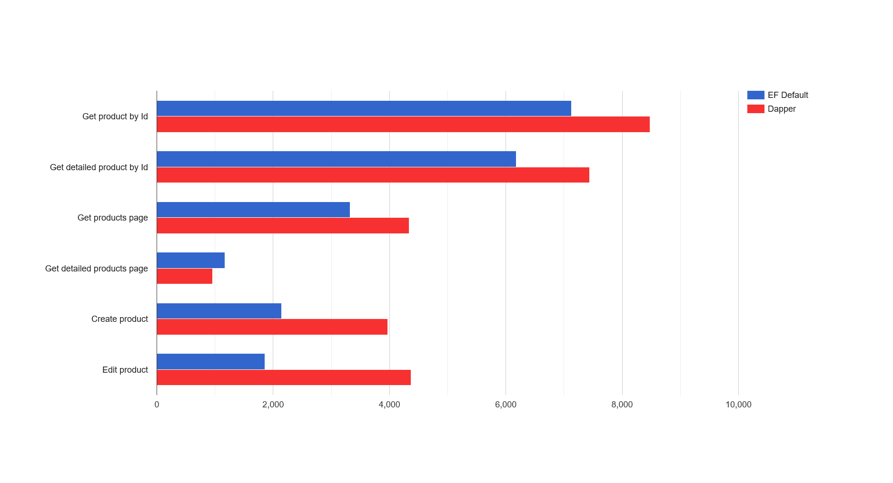
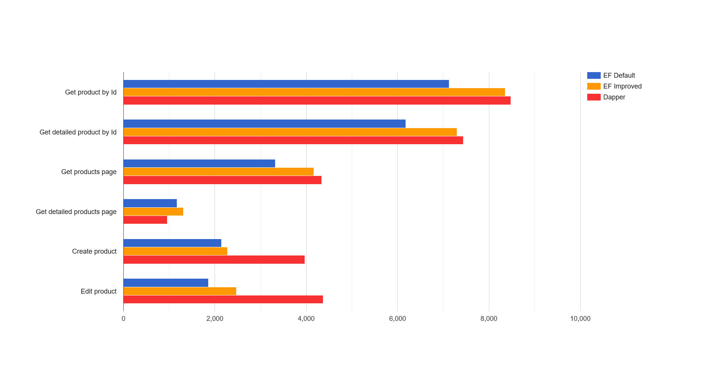

# Entity Framework Core and high performance

Entity Framework Core is recomended and most popular tool for interacting with relational databases on ASP NET Core platform. It is powerful enough to match most of possible scenarious, but, as any other tool has its limitations. Long time people says (not without reason) that Entity Frmaework not match high load systems and for these scenarious it is better to use Dapper. But time goes by and Entity Framework is growing adn getting better, especially from the performance perspective. In addition to internal performance improvements for common APIs of Entity Framework and performance improvements of platform itself, Entity Framework provide special set of features and configuration options dedicated to significantly increase performance. In this article we will consider Entity Framework Core from the performance perspective and compare it with Dapper as of July 2022. Lets check if recomendation "rewrite everything on Dapper" is still actual :)

This article could be useful for developers which use Entity Framework Core in everyday development. Also this article could be helpful to high load system developers to update their knowledge about Entity Framework latest performance oriented features.

## Introduction to EF
Before diving into performance topic it will be usefull to remember what EF is and describe some aspects of its work, so we could better understand optimization approaches which we will consider in this article. So EF is an object-relational mapper, or in other words tool which binds C# object model (classes, collections, properties) with relational database model (tables, columns, rows, foreign keys etc). Main EF object, which allows developer to interacti with database is class inherited from `DbContext`. Context contains several collection-objects `DbSet`, which usually represent database table. To access data in table we call this collections using LINQ queries, which are behind the scenes translated into SQL by calling methods `ToArray`, `ToList`, `FirstOrDefault` etc., so we can work with data as we usually work with regular C# objects.

```csharp
public class AdventureWorksContext : DbContext
{
    public virtual DbSet<Product> Products { get; set; }
    ...
}
...
public void ApplicationLogic()
{
    using var context = new AdventureWorksContext();
    // get list of products with filter
    var bookProducts = context.Products.Where(p => p.Type == "Book").ToList();
    // get single product by name
    var singleBook = context.Products.Where(p => p.Name == "Harry Potter").FirstOrDefault();
    // do data handling
    ...
}
```

The way how EF works gives developers several advantages. Firstly EF takes responsibility for forming correct and SQL injections safe requests to database using strictly typed LINQ queries. The same C# code will work for MSSQL, Oracle and MySQL, because concrete database providers implementations are hidden from developer using abstractions. Developer in most cases shouldnt deal with SQL syntax at all and can fully concentrate on application logic. Secondly, EF includes mechanism, which tracks changes in object properties (change-tracking) which allows to form Update and Delete database queries with no interaction with any SQL code. For example:

  ```csharp
public void ApplicationLogic()
{
    using var context = new AdventureWorksContext();
    var bookProduct = context.Products.Where(p => p.Name == "Harry Potter").Single();
    bookProduct.Name = "Harry Potter and the Sorcerer's Stone"
    context.SaveChanges();
    // name in DB was updated ! 

    context.Remove(bookProduct);
    context.SaveChanges();
    // book was deleted from DB !
    ...
}
```

EF has reach functionality, which makes development process significantly easier and faster, but it comes with a price and each stage of processing before sending SQL request to database and after receiving a response require resources. Let's try to make simplified scheme of how EF works from conctructing LINQ request to revieving data in client code.

1. Getting instance of `DbContext`. To begin the work be need to get instance of `DbContext`, which contains everything we need.
2. Compiling LINQ query to SQL. `IQueryable` interface implementation, which we receive by calling LINQ extension methods on `DbSet`, is a request object which should be executed. Object is constructed in builder-like way: each called method as `Where`, `OrderBy`, `Select` add some additional information to request object, which should be translated to SQL. `IQueryable` inherits from `IEnumerable`, but untill you explicitly call `IEnumerable` (or `IAsyncEnumerable`) methods - SQL query will not be constructed and executed. Translation process begins when method casting `IQueryable` to `IEnumerable` (или `IAsyncEnumerable`) was called, such as `ToArray`, `ToList`, `FirstOrDefault` etc. EF translates `IQueryable` to SQL while supporting internal caching mechanism, which allows to reuse calculation results for same LINQ queries.
3. Sending SQL to database and receiving response. (server-side calculations)
4. Results materialization into C# objects.
5. Objects registration into change-tracking system. After materialization appears, EF by default registers objects in internal change-tracking system, which tracks object property changes and on calling `SaveChanges` forming correspondent Update database query. Supporting change-tracking creates an overhead and require respourses.
6. Performing client side of LINQ query (client-side calculations). Receiving LINQ request EF tries to transform it to SQL so it could be executed on database side (server-side calculations). But in some cases request cannot be translated to SQL so that expression results should be calculated on client side after results from database are received. In earlier versions of EF developer could know that request is executing on client side only from EF logs or by configuring throwing exceptions in such cases, but with latest EF versions, when EF cannot fully convert LINQ query to SQL it will always throw an exception, requiring explicit call of  `AsEnumerable`, `ToList` etc before LINQ expression part, which could be executed only on client code side (client-side calculations). You can get more detailed description of this mechanism on this [Microsoft article](https://docs.microsoft.com/en-us/ef/core/querying/client-eval). It is for the benefit of the developer to write code in a way when most of the calculations, especially in `Where` block, is performed on database server side.
7. Receiving results by calling client code.

As we can see, there are a lot of resourse consuming operations happening between creating `DbContext` instance, calling of ADO NET and receiving results in client code. These operations consume CPU resourses, create a lot of objects, saving reference on them creating GC pressure, fill and flush internal caches etc. Dapper in its turn is a minimalistic proxy between ADO NET and client code, which lacks EF functionality, but have a huge performance benefits over EF. Lets demonstrate some code using Dapper:

```csharp
public void ApplicationLogic()
{
    using var sqlConnection = new SqlConnection(connectionString);
    var product = connection.QuerySingleOrDefault<Product>(@"
        select * from Products 
        where Name = @name
    ", new { name = "Harry Potter" });
}
```

Now as we better understand how EF works and what it does under the hood, we can move on to system under test review, which we will try to optimize.

## System Under Test (SUT)
For demonstration purposes we need some web API, which will interact with test SQL database AdventureWorks, implementing some of most common data access scenarious:
- GET request by Id with data from one table. *Get product by Id*
- GET request by ID with data from multiple related tables (JOIN-s). *Get product with model and product category by id*
- GET request of paged data from single table. *Get products page*
- GET request of paged data from multiple related tables (JOIN-s). *Get products page with model and product category datas*
- POST request for resourse creation. *Create product*
- PUT request for edit resourse. *Edit product name*

We need to implement several versions of API with different implementation of `IProductsRepository` using EF or Dapper to access the data. For a complete load testing we will use NBomber for each of this scenarious one by one. To get more details on working with NBomber you can visit [this article](https://medium.com/@anton_shyrokykh/nbomber-as-an-alternative-to-jmeter-for-net-developer-432040b91763). For more fast running local test we in some cases will use some [BenchmarkDotNet scenarious](https://github.com/MrPomidor/EFCorePerformanceTipsDemo/tree/master/src/Solution/Tests/Benchmarks), which will repeat our API in miniature by calling different `IProductsRepository` implementations (Dapper, EF Default, EF with different improvement options) in DI scope:

```csharp
private ServiceProvider EFCoreDefaultImplementationServiceProvider;
...
[GlobalSetup]
public void GlobalSetup()
{
    BuildDefaultImplementationServiceProvider();
}
...
[Benchmark]
public async Task GetProduct_Benchmark()
{
    // we will do several iterations, emulating several requests, to see difference in time and memory better
    for (int i = 0; i < IterationsCount; i++)
    {
        // as for each HTTP request in web api, we will create DI scope
        using var scope = EFCoreDefaultImplementationServiceProvider.CreateScope();
        // ... from which we will resolve implementation under test 
        var repository = scope.ServiceProvider.GetRequiredService<IProductsRepository>();
        // get product by id scenario as example
        var product = await repository.GetProduct(ProductIds[i % (ProductIds.Length - 1)]);
    }
}
```

After we will get thorugh all performance improvement recomendations [in the list](https://docs.microsoft.com/en-us/ef/core/performance/advanced-performance-topics) we will perform last NBomber test, where we combine all improvements to make some conclusions. All code used in this article, demos, load testing scenarious etc. is available on [GitHub repository](https://github.com/MrPomidor/EFCorePerformanceTipsDemo).

Before we start optimization lets do some initial measurements for Dapper and "out of the box" EF version. We will run each version of application sequentially testing each scenario using 30 paralell clients, sending requests non-stop.



|Scenario|EF Default (RPS)|Dapper (RPS)|
|---|---|---|
|Get product by Id|7124,1|8478,0|
|Get detailed product by Id|6180,5|7439,9|
|Get products page|3320,7|4341,2|
|Get detailed products page|1174,8|954,8|
|Create product|2146,2|3967,9|
|Edit product|1859,8|4371,7|

As we can see, in this configuration EF is **19-30** percent less performant then Dapper in most read scenarious, and significantly inferior in creation and editing scenarios. Now we have point to compare with, so lets start improving.

## DbContext pooling
To raise EF Core performance we need to gradually reduce the influence of intermediate stages ,described earlier, by reducing allocations, repeated calculations and by doing some calculations in advance if possible. First of all Microsoft [recomends](https://docs.microsoft.com/en-us/ef/core/performance/advanced-performance-topics#dbcontext-pooling) using pool for objects of type `DbContext`. Obvious advantage for this recomendation is reducing GC pressure by reusing "heavy" objects, which will positively influence application behavior under load. Easy configuration is another advantage - for enabling pooling you need to change single method call from `AddDbContext` to `AddDbContextPool` in Program.cs. Your data access code (in our case it is implementation of `IProductsRepository`) will not be affected. But worth noting that in this case your `DbContext` essentially becomes a sigletone (instance of `DbContext` in pool will leave during all application life) and should not store any state between usings. However if you need to use some scoped context data, EF developers created a good guide describing such possibility, which you can visit using [this link](https://docs.microsoft.com/en-us/ef/core/performance/advanced-performance-topics#managing-state-in-pooled-contexts). Also it is important to set correct pool size, because when pool size exceeded, new instances of `DbContext` will be created.

```csharp
public static void AddEfCore(this IServiceCollection services, IConfiguration config)
{
    //services.AddDbContext<AdventureWorksContext>((dbContextConfig) =>
    services.AddDbContextPool<AdventureWorksContext>((dbContextConfig) =>
    {
        dbContextConfig.UseSqlServer(config.GetConnectionString(ConnectionStringName));
    });

    services.AddScoped<IProductsRepository, EFCoreProductsRepository>();
}
```

## Disable change tracking for read-only scenarious
As we mentioned before, [change-tracking system](https://docs.microsoft.com/en-us/ef/core/querying/tracking) allows us to update data transforming changed properties of C# objects to SQL Update statements. This system is enabled by default but it makes sense only in scenarious when we need to edit or update something. In read-only scenarious this system just creates additional overhead. Fortunately this system can be easily disabled by calling `AsNoTracking` on your `IQueryable` expression.

```csharp
public async Task<Product> GetProduct(int productId, CancellationToken cancellationToken = default)
{
    return await _context.Products
        .AsNoTracking()
        .FirstOrDefaultAsync(x => x.ProductId == productId, cancellationToken);
}
```

For a couple of years, I got into the habit of always writing requests with `AsNoTracking`, because read-only scenarious usually appears more often then edit. But if you have no such habit, you need to to some work to analyse your data access code, add `AsNoTracking` and do some testing to be sure any edit scenario was not broken.

Worth adding that default request behavior youd be configured in EF in a way, when all request will by default copy `AsNoTracking` behavior without calling it explicitly. You can configure it in `AddDbContext` call. Then you should manually add `AsTracking` in scenarious where you really need to edit smth.

```csharp
public static void AddEfCore(this IServiceCollection services, IConfiguration config)
{
    services.AddDbContext<AdventureWorksContext>((dbContextConfig) =>
    {
        ...
        dbContextConfig.UseQueryTrackingBehavior(QueryTrackingBehavior.NoTracking);
    });
}

public void ApplicationLogic()
{
    using var context = new AdventureWorksContext();
    var bookProduct = context.Products.AsTracking().Where(p => p.Name == "Harry Potter").Single();
    bookProduct.Name = "Harry Potter and the Sorcerer's Stone"
    context.SaveChanges();
}
```

## Using DbContext.Entry for editing
Lets highlight and investigate tests results for editing scenario (Edit product), where Dapper is two times more performant then EF. This result can be easily explained by looking into editing code in EF version of `IProductsRepository`:

```csharp
...
var bookProduct = dbContext.Products.Where(p => p.Name == "Harry Potter").Single(); // < -- 1-st query to db
bookProduct.Name = "Harry Potter and the Sorcerer's Stone"
context.SaveChanges(); // <-- 2-nd query to DB
...
```

For performing update with C# first you need to receive object, by requesting it from database, then modify it in code and call `SaveChanges`, which sends another request to database. Dapper is two times faster for editing because EF need two times more database requests to perform edit. But EF have one more way of edit entities, which allow us to perform single database request. For this we need to manually create `Product` instance, assign required values to properties, manually attach instance to `DbContext` change tracking, selecting only important properties for update if needed, and then call `SaveChanges`. In our case we only need to change product name, so code will be:

```csharp
public async Task EditProductName(int productId, string productName)
{
    var product = new Product { ProductId = productId, Name = productName };

    _context.Products.Attach(product);
    _context.Entry(product).Property(x => x.Name).IsModified = true;

    try
    {
        _ = await _context.SaveChangesAsync();
    }
    catch (DbUpdateConcurrencyException)
    {
        // exception is throws when @@ROWCOUNT is equal to 0
        // which means no entity with such Id was updated
        throw new ProductNotFoundException();
    }
}
```

## LINQ to SQL pre-compilation
Important part of EF work is transformation of LINQ expressions, created by C# developer, to SQL queries, consumed by database. Requests compiling is often performed operation, so it should be considered as optimization target. To avoid LINQ to SQL transformations during application handling workload, EF developers provides a mechanism for pre-compilation of LINQ code into thread-safe delegate, for which all calculation was already performed and which could be saved in static variable to be reused in application. To create such delegate you need to pass your LINQ code into static method `EF.CompileQuery`/`EF.CompileAsyncQuery` also passing all external variables used by your LINQ code as method parameters. As a result you will get delegate of type `Func<TDbContext, TParameter1, ..., TResult>` which you could call not wasting resources on LINQ to SQL translation while application handling workload. 

```csharp
private readonly AdventureWorksContext _context;
...
private static Func<AdventureWorksContext, int, CancellationToken, Task<Product>> _getProductByIdQuery =
    EF.CompileAsyncQuery<AdventureWorksContext, int, Product>((ctx, productId, ct) =>
        ctx.Products.AsQueryable().FirstOrDefault(x => x.ProductId == productId));
...
public async Task<Product> GetProduct(int productId, CancellationToken cancellationToken = default)
{
    return await _getProductByIdQuery.Invoke(_context, productId, cancellationToken);
}
```

Despite the expected benefits of using this approach, such as reducing allocations and CPU using, it also comes in a cost. Firstly, as you can notice from code sample, code became a bit less readable. Secondly, to use this approach you should consider spending more time then on adding `AsNoTracking`, especially for rewriting and testing existing code. Separately I would like to note that `EF.CompileAsyncQuery` method interface is, in my opinion, a bit confusing and not documentation is not very detailed. To get familiar with existing documentation, please follow [this link](https://docs.microsoft.com/en-us/ef/core/performance/advanced-performance-topics#compiled-queries).

## Disable internal concurrency checks
`DbContext` in Entity Framework Core, unlike the full framework version, is not supporting multithread scenarious. To support this limitation EF contains internal checks, which detects accessing `DbContext` from several threads and by means of clear exception notify developer on improper context using. However, if your application was repeatedly tested in production for a long time, you are absolutely sure that you have no concurrency errors and you are using `DbContext` in a correct way, should we consider such checks as an overhead which we can optimize ? All recomendations above could create some discomfort while development and have some limitation, but none of them compromise the correctness and operability of EF. Disabling concurrency checking code could have unpredictable effects and there is a direct warning about it in EF documentation:

> **WARNING**: Only disable thread safety checks after thoroughly testing that your application doesn't contain such concurrency bugs.

But in the context of this article when listing ways to improve EF performance metrics it worth noting that we have ability to disable such checks in for `DbContext`. To do this you need to call correspondent configuration method in `AddDbContext`:

```csharp
public static void AddEfCore(this IServiceCollection services, IConfiguration config)
{
    services.AddDbContextPool<AdventureWorksContext>(
        dbContextConfig =>
        {
            ...
            dbContextConfig.EnableThreadSafetyChecks(enableChecks: false);
        });
    ...
}
```

This optimization options among others was tested with BenchmarkDotNet but comparing to others shows minimal influence on application performance. Unfortunately, I was not managed to reproduce **5** percent performance improvement described in [this GitHub issue](https://github.com/dotnet/efcore/pull/24125#issuecomment-777780033). It is up to you whether to apply this optimization or not.

|Scenario name|EF Default (ms)|EF Disable concurrency check (ms)|EF Context Pooling (ms)|EF Context Pooling and Disable concurrency check (ms)|
|---|---|---|---|---|
|Create|2,015.9|2,031.8|1,867.9|1,876.7|
|Edit|2,404.7|2,400.6|2,245.6|2,258.2|
|Get by Id|1,067.5|1,055.8|859.2|886.6|
|Get by Id full|1,186.6|1,246.2|984.8|973.0|
|Get page|8,752|8,426|8,105|8,102|
|Get page full|3,413|3,429|3,368|3,394|

## Combining improvements
We have considered main recomendations from Microsoft for improving performance of EF, explored how did they work and possible pitfals. Lets summarize the list:
- use `DbContext` pooling
- use `AsNoTracking` for read-only scenarious
- use pre-compiled LINQ to SQL queries
- disable EF internal concurrency checks (remembering the risks)

It is time to combine them and run load test.



|Scenario|EF Default (RPS)|EF Improved (RPS)|Dapper (RPS)|
|---|---|---|---|
|Get product by Id|7124,1|8354,3|8478,0|
|Get detailed product by Id|6180,5|7297,5|7439,9|
|Get products page|3320,7|4165,5|4341,2|
|Get detailed products page|1174,8|1306,2|954,8|
|Create product|2146,2|2279,1|3967,9|
|Edit product|1859,8|2472,0|4371,7|

According to the results of testing of three API versions we can see that improvements allows us to increase performance of EF compasing to "out of the box" configuration on **6-25** percents. Also the gap between Dapper and EF was significantly reduced and now Dapper is only **1.5-4.2** percents better for read scenarious.

Unfortunately we were not able to get performance similar to Dapper for edit and create scenarious, while isolating C# developer from writing SQL code. Dapper is **76** better in edit scnenario and **74** better in create scenario. However worth noting that EF still allows developer to write SQL queries manually using `DbContext.Database.ExecuteSqlRaw`. This way you can optimize the bottleneck without using external libraries except EF. Benchmark results shows us that EF `ExecuteSqlRaw` performance is almost identical to code written with Dapper for both scenarious:

```csharp
public async Task EditProductName(int productId, string productName)
{
    var rowsAffected = await _context.Database.ExecuteSqlRawAsync(@"UPDATE [Production].[Product]
        SET [Name] = {0}
        WHERE [ProductID] = {1}
        SELECT @@ROWCOUNT", productName, productId);
    ...
}
```

|Benchmark name|Mean (ms)|Allocated (MB)|
|---|---|---|
|Edit_Default|2,404.7|70|
|Edit_CombinedImprovements|1,780.5|21|
|Edit_ContextPoolingRawSql|940.6|4|
|Edit_Dapper|916.6|3|

```csharp
public async Task<int> CreateProduct(Product product)
{
    var productId = await _context.Database.ExecuteSqlRawAsync(@"INSERT INTO [Production].[Product]
        (Name, ProductNumber, SafetyStockLevel, ReorderPoint, StandardCost, ListPrice, Class, Style, Color, SellStartDate, DaysToManufacture)
    VALUES
        ({0}, {1}, {2}, {3}, {4}, {5}, {6}, {7}, {8}, {9}, {10})
    SELECT CAST(SCOPE_IDENTITY() as int)",
    product.Name, product.ProductNumber, product.SafetyStockLevel, product.ReorderPoint, product.StandardCost, product.ListPrice, 
    product.Class, product.Style, product.Color, product.SellStartDate, product.DaysToManufacture);

    return productId;
}
```

|Benchmark name|Mean (ms)|Allocated (MB)|
|---|---|---|
|Create_Default|2,015.9|77|
|Create_ContextPoolingRawSql|947.9|9|
|Create_Dapper|941.3|7|

Worth noting that in [EF 7 roadmap](https://docs.microsoft.com/en-us/ef/core/what-is-new/ef-core-7.0/plan#performance-of-database-inserts-and-updates) it is planned to perform optimization of change-tracking mechanism and improve performance for Insert and Update scenarious:

> For EF7, we plan to focus on performance related to database inserts and updates. This includes performance of change-tracking queries, performance of `DetectChanges`, and performance of the insert and update commands sent to the database.

We can track the development process on [GitHub](https://github.com/dotnet/efcore/issues/26797) hoping that gap between EF and Dapper will be significantly reduced with next release.

## Summary
As we can see, EF Core as for July 2022 with correct configuration can show results comparable to Dapper for most read scenarious while saving advantage of generation of correct and safe SQL code while using strictly-typed C# LINQ expressions. However EF still far behind Dapper in Insert and Update scenarious while using C# objects and change-tracking for editing, but developers can optimize this by using raw-sql approach if needed. We could expect reducing the gap between EF and Dapper in these scenarious in next release. In my opinion, as practice showns, EF Core of latest version is quite applicable for using in high load systems. Given the rich functionality, support, powerfull community and evolving performance of EF Core and NET platform with each release, you will make right decision by choosing EF Core. Hope this article was useful for you.

Thank you for your attention !