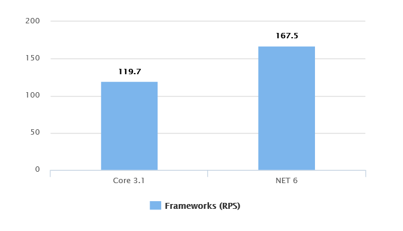
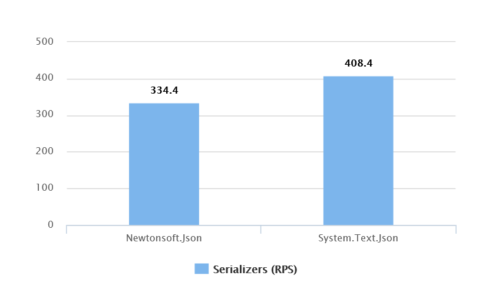
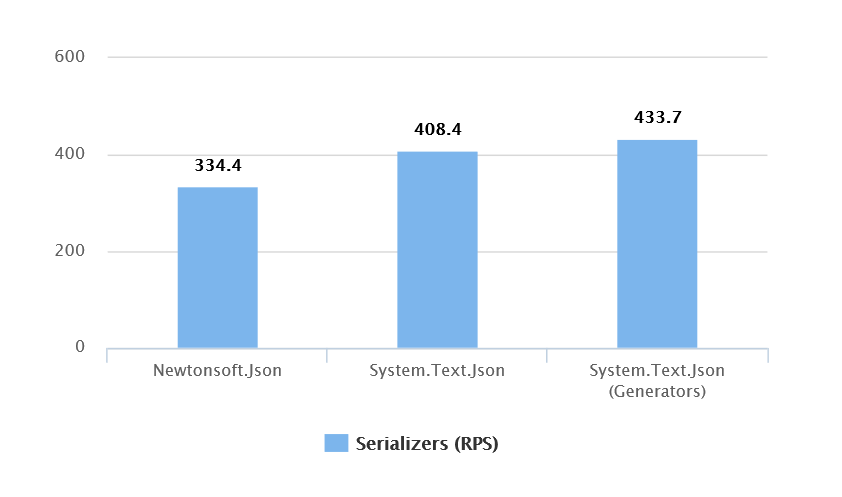
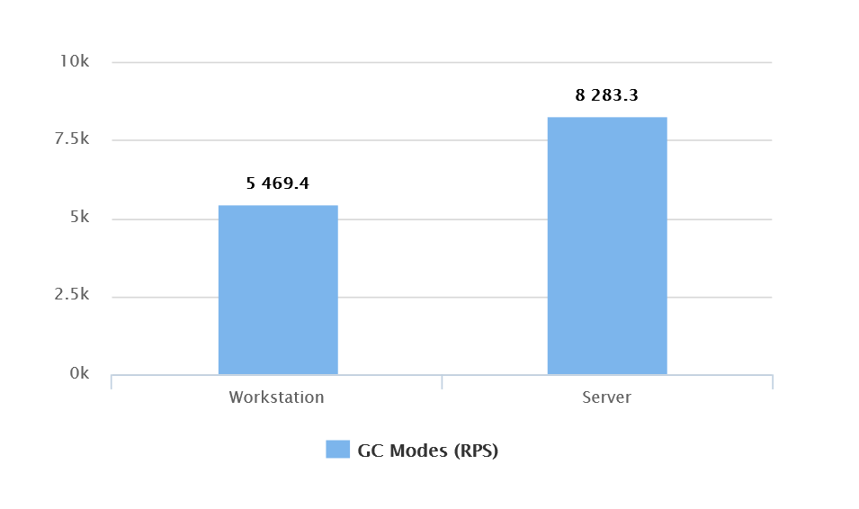
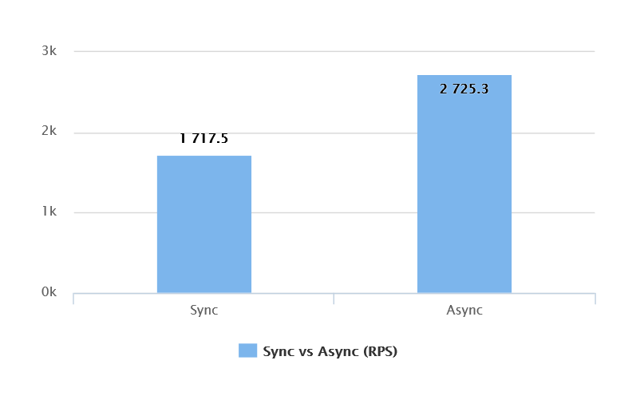
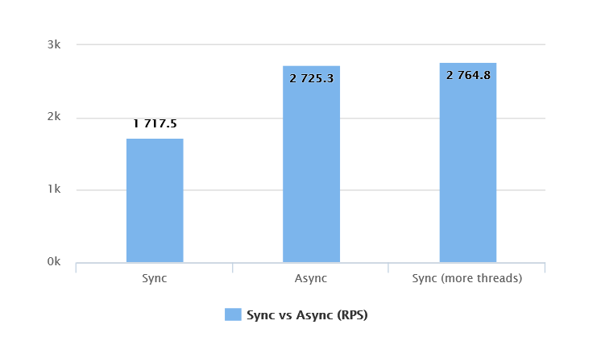

# Simple steps towards boosting ASP NET Core application performance

## Intro
It is a matter of time when you face performance related issues while developing applications. After searching using different data sources you will find a list of performance advices for concrete situations as well as for entire application. In this article we will consider performance advices, which aims to boost entire application performance with maximum effect while minimazing development effort. We will test how this advices will affect application performance, calculate performance boost and analyze if there are any pitfalls to point out.

This article will be usefull for developers and developer leads, striving for high application performance. Also it will be useful for experienced developers, for being used as a starting point for creating own ASP NET Core performance checklist or extending existing one.

## When do we need to optimize ?
Performance is a large and complicated topic. For covering it we need to adress every application aspect: from source code, written by your team, to external libs in use, databases, insrastructure etc. Also while talking about performance it will be an omission not to talk about performance meausrement. To define system performance level and its behavior under the load we need performance testing using variety of monitoring tools.

In any application from simple CRUD to distributed microservice based system there will be always issues, a lot of real (or imaginary) performance bottlenecks and too many things can go wrong. Talking about performance what shall we begin with ? Lets narow a search field by modelling different situations which developers usually face.

According to my experience, the situation when users expirience significant discomfort from slow interaction with application is the most common source of performance optimization tasks. Often solving this kind of tasks requires focus on concrete application part. Code changes are very local and rarely affect entire application. Each situation is unique and require individual approach. There are no single way to solve these issues, only common approach - define bottleneck with performance testing, safe initial metrics and do improvements until results became satisfactory.

What are alternative sources of performance optimization tasks ? Lets imagine sales departament reporting amaizing  contract with new partner was signed and soon your application will get tens of thousands of new active users, or powerfull marketing company was planned where expected effect is similar. In this case we also need some kind of optimization but it became far more complicated to define a concrete tasks and work focus area. The tasks could be formed as *"We need to make our entire application more scalable and fast"*. What approach can we apply to solve tasks with such wide focus area ? Does it means that we need to optimize each endpoint is our application or at least a dozen of most often called, or we have some other solution which requires less effort ? Are there any performance recomendations, following which will take minimum efforts but will generate significant positive effect for entire application performance ?

Doing short research in the internet, you will likely to find list of such recomendations for boosting performance for entire ASP NET Core application, but before applying them you need more knowledge regarding required developer efforts and predicted effect on your application throughput (highly desirable to have some concrete numbers in percents or RPS). This is the topic we will highlight in this article.

In this article we will go through next recommendations:
- use latest version of Frameworks and dependent libs
- use System.Text.Json for request serialization/deserialization
- use Server GC mode
- use async/await
- manually configure threads in thread pool

## What do we need to remember before we start optimization ?
Before performance optimization starts you need to consider two point.

Firstly, you application should not lost functionality. To protect application from regression bugs you need to have integration and end-to-end tests scope in place, which will confirm that changes did not broke anything and application is working fine. This point is true for any refactoring.

Secondly, any performance optimizations should rely on metrics. You should record initial results before making changes to be sure you make performance better, not worth. Even simple and from first glance predictable changes could lead to unexpected perforamnce degradation, and we will consider case which demonstrate this next in this article.

## System under test
For testing different recommendations we will use some kind of cutted CMS system on ASP NET Core with Entity Framework, based on Microsoft test database Adventureworks. This CMS will return goods and orders, which makes it similar to the most of services which accepts requests and return some data from database. Database and other dependencies will be up and running with `docker compose up -d`. We will use [NBomber](https://medium.com/@anton_shyrokykh/nbomber-as-an-alternative-to-jmeter-for-net-developer-432040b91763) as load testing tool and `dotnet counters` and PErfView as monitoring tools. All demos and code samples for this application are available on [GitHub](https://github.com/MrPomidor/ASPNetPerfImprovementsDemo).

Worth noting that results which we will get are unique for OS and handware configuration on which we will run performance testing. Its purpose is to demonstrate the effect and give some relative numbers for being used in estimates forecasts. For your system numbers could be different. You should always confirm positive (or negative) effects on a system which is as close to your prod configuration as possible.

## Reccomendation 1: Use latest versions of framework and libraries
Releasing new version of .NET framework and related libraries and packages, such as ASP NET Core and Entity Frameowrk Core Microsoft not only extends APIs and introduces new features, but also continuously working on performance improvements. Memory consumption optimization, extending existing APIs with copy-free types support as `Span` or `Memory`, extending support for `ValueTasks` etc. To track optimization related work you can visit issues with related tags on GitHub (for example for [ASP NET](https://github.com/dotnet/aspnetcore/labels/area-perf) and [Runtime](https://github.com/dotnet/runtime/labels/optimization)). Reading release notes of newer versions we can point that framework becames faster eventually.

Updating framework version on your project could be fast and safe (just change `TargetFramework` in project configuration and update related NuGet packages version), but it could also be complicated and unpredictable process, which require serious code changes, adapting API of new library versions, fixing bugs which can appear etc. In order to make decision for updating framework version team lead requires some understanding on what results it will bring and how benefitial it will be from application performance point of view. Let's make some test and try to answer this questions.

For this test we will need two API projects with different LTS framework versions (Core 3.1 and NET 6) which will have identical code. We will test two methods:

```csharp
private readonly AdventureWorks _dbContext;
public CustomerController(AdventureWorks dbContext)
{
    _dbContext = dbContext;
}

[HttpGet("orders")]
public async Task<IActionResult> GetOrders(int pageNumber = 1, int pageSize = 100)
{
    var orders = await _dbContext.SalesOrderHeaders.AsQueryable().AsNoTracking()
        .Include(x => x.SalesOrderDetails)
        .OrderBy(x => x.SalesOrderID)
        .Skip((pageNumber - 1) * pageSize)
        .Take(pageSize)
        .ToListAsync();
    return Ok(orders);
}

[HttpGet("products")]
public async Task<IActionResult> GetProducts(int pageNumber = 1, int pageSize = 100)
{
    var products = await _dbContext.Products.AsQueryable().AsNoTracking()
        .OrderBy(x => x.ProductID)
        .Skip((pageNumber - 1) * pageSize)
        .Take(pageSize)
        .ToListAsync();
    return Ok(products);
}
```

In our [load test scenario](https://github.com/MrPomidor/ASPNetPerfImprovementsDemo/tree/master/Solution/FrameworkVersionsComparison) will will have 14 clients (7 for each method) which will send maximum possible number of requests during 3 minutes test. Thats how we can see the difference in peak throughput. To became more familiar with NBomber you can visit next [link](https://nbomber.com/docs/loadtesting-basics).

```csharp
var ordersScenario = ScenarioBuilder.CreateScenario("Orders", getOrdersPageStep)
    .WithWarmUpDuration(TimeSpan.FromSeconds(10))
    .WithLoadSimulations(
        LoadSimulation.NewKeepConstant(_copies: 7, _during: TimeSpan.FromMinutes(3))
    );

var productsScenario = ScenarioBuilder.CreateScenario("Products", getProductsPageStep)
    .WithWarmUpDuration(TimeSpan.FromSeconds(10))
    .WithLoadSimulations(
        LoadSimulation.NewKeepConstant(_copies: 7, _during: TimeSpan.FromMinutes(3))
    );
```

As a result we can see significant performance growth - application could handle **39** percents requests more (with average response time lower then 1 second).



|Framework|orders (RPS)|orders mean (ms)|products (RPS)|products mean (ms)|all (RPS)|
|---|---|---|---|---|---|
|Core 3.1|23.6|241.09|96.1|63.29|119.7|
|NET 6|35.4|197.29|132.1|52.98|167.5|

Worth noting that we tested peak throughput. When testing there methods under normal load with stable RPS, average response time will be not significantly lower.

|Framework|orders mean (ms)|products mean (ms)|
|---|---|---|
|Core 3.1|292.49|99.61|
|NET 6|238.46|102.17|

Upgrading framework version as we can see allows application to handle more requests and higher throughput. Developer efforts for upgrading frameowrk version could vary from one project to another. But you can makes efforts more predictable by doing some preparations, learning libraries being used and reading Microsoft [framework migration guides](https://docs.microsoft.com/en-us/aspnet/core/migration/31-to-60?view=aspnetcore-6.0&tabs=visual-studio). Recommendation for upgrading framework version, as for me, looks pretty viable and corresponds to criteria "minimum effort - significant impact on entire application".

## Recomendation 2: Use System.Text.Json
Serialization code participates in every response, which means it is definetely part of any hot path in the API application. For a long time Newtonsoft.Json with all its reach functionality was used as default serializer, but starting from ASO NET Core 3.0 it was substituted with System.Text.Json.

If new more performant serializer is used by default for all projects starting from ASP NET Core 3.0 (which was released more then 3 years ago) is it useful to recomend anyone to migrate to System.Text.Json. Yes, it is. Many applications were written with rely on Newtonsoft.Json API, such as hand-written JsonConverters. For saving backwards compatibilitymany developers choose to leave Newtonsoft.Json as default json serializer and dont perform a migration. Backwards compatibility is provided with `Microsoft.AspNetCore.Mvc.NewtonsoftJson` package which is still popular even for NET 6.


Worth noting that System.Text.Json differs from Netwonsoft.Json more then Core 3.1 differs from NET 6. System.Text.Json has more strict rules by default and also dont support some scenarious (you can read more about it [here](https://docs.microsoft.com/en-us/dotnet/standard/serialization/system-text-json-migrate-from-newtonsoft-how-to)). Serialization/deserialization code usually segregated from controllers and application logic and configured in Program.cs/Startup.cs, but if your code will not work with System.Text.Json "out of the box", you could spend significant effert on migration. To make this decision you need to know how it affects your application performance and throughput.

For test we will need two identical projects on NET 6 which will only differs with default serialiser.

We will test two API endpoints. First will return order entity by id, for testing small objects (~1 KB). Second withh return page with 100 order entities, for testing performance on large objects (~190 KB). In our [test scenario](https://github.com/MrPomidor/ASPNetPerfImprovementsDemo/tree/master/Solution/SerializerComparison) we will see peak load with 20 paralell clients (10 for each endpoint).



|Serialization Framework|order (RPS)|order mean (ms)|orders (RPS)|orders mean (ms)|all (RPS)|
|---|---|---|---|---|---|
|Newtonsoft.Json|284.4|35.14|50|199.65|334.4|
|System.Text.Json|348.1|28.7|60.3|165.78|408.4|

According to test results, application throughput has grewn by **22** percents. As we can see migration to System.Text.Json can significantly improve application behaviour under the load. Also worth noting lowered memory consumption and GC pressure (tested with same RPS for both versions):

|Serialization Framework|Allocation rate (MB/sec)|Process working set (MB)|
|---|---|---|
|Newtonsoft.Json|15.599|351.977|
|System.Text.Json|11.693|278.454|

But this is not the limit for System.Text.Json. With codegenerators feature appeared in NET 6 we are able to make auto-grnrated serializers for your models to make performance even better because of reflection-free code. You need to create `partial` context class, inherited from `JsonSerializerContext`, point required classes via attributes, then register context in Program.cs/Startup.cs.

```csharp
[JsonSerializable(typeof(SalesOrderHeader))]
[JsonSerializable(typeof(List<SalesOrderHeader>))]
public partial class AdventureWorksContext : JsonSerializerContext
{
}
```

```csharp
public static void Main(string[] args)
{
    var builder = WebApplication.CreateBuilder(args);
    ...
    builder.Services
        .AddControllers()
        .AddJsonOptions(options => {
            options.JsonSerializerOptions.AddContext<AdventureWorksContext>();
        });
    ...
}
```

However you should know that use generators has its costs. If for majority of Newtonsoft.Json functions you could find analogue or workaround in System.Text.Json, for generators most of customization, including custom value converters, is unavailable (more detailed about limitations could be found [here](https://docs.microsoft.com/en-us/dotnet/standard/serialization/system-text-json-source-generation-modes?pivots=dotnet-6-0)). Functionality for handling cyclic references is also unavailable when using generators, which we can see even in test scenarious. When using entity framework models you could have parent entity which contains reference to collection of childs, when each child contains reference to parent. In our test scenario we have `OrderHeaderHeader` and `SalesOrderDetail`:

```csharp
[Table("SalesOrderHeader", Schema = "Sales")]
public partial class SalesOrderHeader
{
    ...
    public virtual List<SalesOrderDetail> SalesOrderDetails { get; set; }
}

[Table("SalesOrderDetail", Schema = "Sales")]
public partial class SalesOrderDetail
{
    ...
    public virtual SalesOrderHeader SalesOrderHeader { get; set; }
}
```

To solve this issue you have several options available. First option is to limit using of navigation properties in models, which mean rewriting application and limiting development convenience. Seond option is manually setting null to all references. Both of this options are handly representing "minimum efforts" principle, but let's see if it worth it.



|Serialization Framework|order (RPS)|order mean (ms)|orders (RPS)|orders mean (ms)|all (RPS)|
|---|---|---|---|---|---|
|System.Text.Json|348.1|28.7|60.3|165.78|408.4|
|System.Text.Json (with generators)|370.8|26.94|62.9|158.88|433.7|

Comparing with default System.Text.Json we can see that application became **6** more performant. It is up to you to decide if using generators worth it. But migration from Newtonsoft.Json to System.Text.Json, as for me, is worth considering as good recomendation.

## Recomendation 3: Use server GC mode
.NET framework have garbage collection mechanism which in most cases frees developer from worying about memory management in the application. In most cases until application performance becoming an issue. This relates to how the garbage collection works in .NET. Telling long story short we can say that for garbage collection runtime stops application functioning (running threads) and continue only when garbage collection is completed. More actively application allocates objects in memory, more time runtime performs a GC, more time application is blocked. Time of GC work can be usually measured in percents from entire application worktime. What values should be considered as normal ? It is hard to say, but most of the sources agrees that if GC takes 20 percent of your application worktime, you definetely have some troubles :)

> ### Allocation is cheap… until it is not
> 
> *Konrad Kokosa*

We can distinquish two approaches for optimizing GC work. First - rewrite application code with focus to low memory allocation using such techniques as object pooling, copy-free methods for working with arrays with `Span` or `Memory`, using structs instead of objected whenever it is possible, avoiding boxing/unboxing etc. This approach means a lot of developer effort in rewriting entire application code, which definetely not match the topic of this article.

Second approach - configure GC for more optimal work. We have two mods of GC work: workstation and server. I will try to tell the long story short, but if you want to get full and correct picture, please visit next links: [link 1](https://docs.microsoft.com/en-us/dotnet/standard/garbage-collection/workstation-server-gc), [link 2](https://devblogs.microsoft.com/premier-developer/understanding-different-gc-modes-with-concurrency-visualizer/). In workstation mode there is one priority thread which is doing garbage collection in a single heap. In server mode for each logical CPU (more details on [logical CPU](https://unix.stackexchange.com/questions/88283/so-what-are-logical-cpu-cores-as-opposed-to-physical-cpu-cores)) you have a heap and distinct priority thread doing garbage collection. This means that with same entire heap size in server mode garbage collection should be performed faster. Also in server mode heaps also takes more memory, which allows to collect garbage less intensive then in workstation mode, so that we sacrifize application low memory consumption for performance.

To enable server GC mode you need to add next value in project configuration:

```xml
<Project Sdk="Microsoft.NET.Sdk.Web">
	<PropertyGroup>
		<TargetFramework>net6.0</TargetFramework>
		<ServerGarbageCollection>true</ServerGarbageCollection>
        ...
	</PropertyGroup>
    ...
</Project>
```

Worth noting that ther is a pecularity in GC mode configuration. [Documentation](https://docs.microsoft.com/en-us/dotnet/standard/garbage-collection/workstation-server-gc) says that for standalone applications default GC mode is workstation, but for hosted applications (ASP NET Core is a hosted application) GC mode is defined by host settings. Unfortunately I did not find more detailed info about when host defined GC mode as workstation and when as server. While creating demo ASP NET Core applications for this articles GC mode was automatically defined as server. You can see what mode is active by using `System.Runtime.GCSettings.IsServerGC` property in runtime, but I would recomend you to set GC mode explicitly in configuration.

For test we will need [two identical API projects](https://github.com/MrPomidor/ASPNetPerfImprovementsDemo/tree/master/Solution/GCModeComparison) on NET 6 which will differ only in `ServerGarbageCollection` settings. Lets try it out with peak load.



|GC Mode|order (RPS)|order mean (ms)|
|---|---|---|
|Workstation|5469.4|9.13|
|Server|8283.3|6.03|

According to test results, server mode is **51** percent more performant then workstation, so we can state - it your application for some reasons is working in workstation mode, server mode will help dramatically increase you application performance with minimum efforts.

## Recomendation 4: Use async/await
In ASP NET Core application one thread could handle one incoming request from the user. Amount of threads in pool is limited. If while processing execution thread will face synchronous I/O bound operation, it will just wait, wasting CPU resouses. Thread in this situation cannot do any useful work until operation is completed. If while handling multiple requests most of threads will be blocked the same way, application throughput and scalability will be limited. Recomendation in this case is simple - use asyncronous method overloads with async/await. The thread instead of waiting will return to thread pool ready to do business useful job and your application could handle more requests.

This recomendation unlike previous ones means multiple code changes in your application, from API controller method signature to final point of calling DB from, for example, Entity Framework Core. Development efforts for this kind of refactoring could be quite significant, including also integration testing for reducing regressions. Why we are considering this recomendation in terms of this article ?

Firstly, because translating code to async/await is quite simple from my point of view. Translating call chaing to using async/await even could be performed automatically using Roslyn analysers and code fixes (such analysers are described in next articles: [article 1](https://www.meziantou.net/enforcing-asynchronous-code-good-practices-using-a-roslyn-analyzer.htm) and [article 2](https://cezarypiatek.github.io/post/async-analyzers-summary/)). To predict required effort it is enough to run analyser setting `severity = error` for async-related rules. This kind of refactoring with good preparations and good tests coverage could be performed quite fast and safe.

Secondly, this recomendation is still actual. It is not a secret that there exists a lot of projects written long time ago using old framework and libraries versions. This kind of projects are still supported. Support tasks for this kind of projects also could include increasing responsiveness and performance of application. During last 2 years I face three similar projects where we did such kind of refactoring, also for the purpose of improving application performance.

Before making this decision it will be useful for team lead to know what affect it can potentially have on application thoughput. To get this data lets run peak load test for [two versions of API](https://github.com/MrPomidor/ASPNetPerfImprovementsDemo/tree/master/Solution/SyncAsyncComparison) which consists from two methods: first for returning entity by id, second will be more heavy and returning page of 100 entities. First API version will be fully synchronous, second will be fully asynchronous.



|API version|order (RPS)|order mean (ms)|orders (RPS)|orders mean (ms)|all (RPS)|
|---|---|---|---|---|---|
|Sync|1257.3|39.74|460.2|108.57|1717.5|
|Async|2316.3|21.57|409.9|121.89|2725.3|

According to test results we can see that entire application throughput was increased by **58** percents, so recommendation to rewrite application to async/await can be considered viable. But seing the results we must pay our attention to the method which returns page results. According to NBomber report its performance became **11** percent lower. By running another test for this method only we can confirm performance degradation while switching to async/await:

|Method|RPS|Mean (ms)|
|---|---|---|
|Get orders page (Sync)|579.3|172.5|
|Get orders page (Async)|568.7|174.41|

This can teach us that event changes effect from which seems predictable could lead to unexpected results. It is important to point out that any optimization results should be confirmed by means of load tests and measuring.

## Recomendation 5: Manually configure threads in thread pool
While testing synchronous API from previous recomendation we also collected some threads-related stats using `dotnet counters`:

|API version|ThreadPool Thread Count|ThreadPool Queue Length|
|---|---|---|
|Sync|34|50|
|Async|31|0|

As we can see, if all operations are synchronous and there are not enough threads in the pool, work to be starts piling up in the thread pool queue. Thread pool have ability to extend under some circumstances and it is highly possible that thread pool will adapt to this load, but it will take some time. Can we somehow affect on this situation and set required threads count manually ? Yes, we can with help of `ThreadPool` class.

```csharp
const int WorkerThreads = 70;
const int CompletionPortThreads = 70;

if (!ThreadPool.SetMinThreads(WorkerThreads, CompletionPortThreads))
    throw new ApplicationException("Failed to set minimum threads");
```

Worth noting that manual configuration of thread pool size can affect application performance either in positive or in negative way. By default thread pool manages threads count using various metrics, such as CPU cores count, amount of work in the queue etc. Automatic management should find a balance when threads count is anough to manage application load but not greater, not to increase context switching overhead ([documentation](https://docs.microsoft.com/en-us/dotnet/api/system.threading.threadpool.setminthreads?view=net-6.0#remarks)).

As a starting point we can take threads amount involved in synchronous API testing (**34**) and try to increase this amount by adding thread pool queue length from same test (**50**). Round result number to **70** and perform a test. 



|API version|order (RPS)|order mean (ms)|orders (RPS)|orders mean (ms)|all (RPS)|
|---|---|---|---|---|---|
|Sync|1257.3|39.74|460.2|108.57|1717.5|
|Async|2316.3|21.57|409.9|121.89|2725.3|
|Sync (SetMinThreads(70, 70))|2336|21.39|428.8|116.32|2764.8|

As a result of manual threads amount management, syncronous API performance closely approaches metrics for asyncronous API. We can make a conclusion that in some cases manual intervention into threads management can help to increase application performance without any significant code changes. This approach could be useful when you have no ability to perform async/await refactoring. But you need to use it with great caution, after testing on environment which is as close to production as possible.

## Summary
In this article we have considered several recomendations on improving performance of ASP NET Core applications. We have tested them and collect data on the impact of each recomendation on application performance. This data should help developers and team leads in making decisions about applying this recomendations on their projects. Source code for all demos used in this article, code for load test scenarious and more detailed testing reports are available on [GitHub](https://github.com/MrPomidor/ASPNetPerfImprovementsDemo).

Hope this article was usefull for you. As next article I will consider analysing latest releases of Entity Framework Core from performance perspective.

Thank you for your attention !