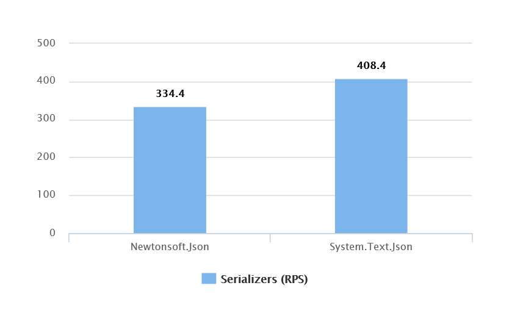

# Простые шаги по повышению производительности ASP NET Core приложения

## Вступление
Разработка сложной системы предполагает что вы, рано или поздно, столкнетесь с вопросом повышения производительности вашего приложения. Выполнив поиск по разным источникам вы найдете множество рекомендаций по улучшению производительности как для конкретных ситуаций и узких мест, так и применимых для всего приложения. В этой статье мы рассмотрим те рекомендации, которые призваны улучшить производительность всего приложения при минимальных трудозатратах. Мы протестируем оказываемый на приложение эффект, вычислим возможный прирост производительности от каждой из них и рассмотрим нет ли подводных камней, которые стоит учитывать.

Статья будет полезна разработчикам и лидерам команд, стремящимся улучшить производительность системы в целом. Также статья будет полезна опытным разработчикам, которые смогут использовать список рекомендаций из данной статьи в качестве отправной точки для создания или дополнения собственного чеклиста по улучшению производительности ASP NET Core приложений.

## Когда возникает необходимость в оптимизации
Производительность это большая и сложная тема. Для ее раскрытия в полной мере требуется затронуть все части приложения: от исходного кода, написанного вашей командой, до используемых сторонних библиотек, баз данных и инфраструктуры. Также нельзя раскрыть тему производительности, обойдя стороной вопрос ее измерения. Для определения уровня производительности системы, ее поведения под нагрузкой, необходимо проведение нагрузочного тестирования, используя также разнообразные инструменты мониторинга.

В любом приложении от простого CRUD до распределенной микросервисной системы всегда найдутся нюансы, множество реальных (и мнимых) узких мест и слишком многое может пойти не так при попытке оптимизации. С чего же начать ? Давайте попытаемся сузить область поиска, смоделировав разные ситуации когда разработчики обычно сталкиваются с необходимостью оптимизации.
 
По моему опыту, наиболее частый источник задач по оптимизации это ситуации, когда пользователи испытывают ощутимый дискомфорт при работе с определенной функцией приложения. Решаются такие задачи чаще всего внесением изменений в определенную часть кода, редко затрагивая остальное приложение. Каждая такая ситуация уникальна и требует индивидуального подхода к ее решению. Общих рекомендаций по решению таких задач обычно нет, есть только общий подход - подтвердить проблемный участок кода с помощью нагрузочного тестирования, зафиксировать начальные результаты и вносить улучшения до достижения приемлимых значений.

В каких еще случаях разработчики задумываются о повышении производительности ? Например, отдел продаж радостно сообщает что скоро будет подписан договор с новым клиентом что принесет несколько десятков тысяч новых пользователей, или что планируется мощная маркетинговая кампания со схожим ожидаемым эффектом. В данном случае возникает необходимость в оптимизации, но гораздо сложнее определить конкретную задачу и фокус подготовительных работ. Задача может звучать следующим образом: *"Необходимо повысить производительность всего приложения"*. Какой можно применить подход для решения задачи с настолько широким охватом ? Значит ли это что придется оптимизировать каждую функцию в приложении (или как минимум дюжину наиболее часто вызываемых), или есть менее трудозатратное решение ? Есть ли рекомендации по повышению производительности, для исполнения которых требуются минимальные трудозатраты, и которые при этом имеют достаточный эффект для всего приложения ?

Выполнив небольшое исследование в интернете вы сразу найдете несколько рекомендаций для общего повышения производительности ASP NET Core приложения, но перед их применением вам нужно иметь достаточно информации о том сколько трудозатрат необходимо для каждой из них, и какой эффект они смогут оказать для пропускной способности вашего приложения (желательно иметь цифры в RPS - requests per second). На этот вопрос мы и постараемся ответить в этой статье.

С данной статье мы рассмотрим следующие рекомендации:
- Используйте последние версии фреймворка и библиотек
- Используйте System.Text.Json
- Используйте серверный режим работы GC
- Используйте async/await
- Вручную настройте количество потоков в пуле

## О чем нужно помнить перед началом работ по оптимизации
Перед началом работ по оптимизации, необходимо учитывать два важных фактора.

Во-первых, ваше приложение не должно потерять в функциональности. Для защиты от регрессии у вас должен быть набор интеграционных или end-to-end тестов, который подтвердит что изменения не сломали ваш функционал. Это справедливо для любого рефакторинга.

Во-вторых, при любых оптимизациях обязательно опирайтесь на метрики. Вы должны зафиксировать значения до внесения изменений, чтобы убедится, что вы сделали лучше, а не хуже. Даже самые простые и на первый взгляд предсказуемые изменения могут привести к неожиданной деградации производительности, в чем мы с вами убедимся во время одного из тестов.

## System under test
Для проверки разных рекомендаций мы будем использовать урезанную версию CMS (ASP NET Core API и Entity Framework Core), основанную на тестовой базе Microsoft (Adventureworks), которая может возвращать товары и заказы. Приложение будет похоже на большинство веб-сервисов, которые принимают запросы и что-то возвращают из базы данных. База и другие зависимости будут разворачиваться командой `docker compose up -d`. В качестве инструмента нагрузочного тестирования мы будем использовать [Nbomber](https://habr.com/ru/post/664824/), а в качестве инструмента мониторинга `dotnet counters` и PerfView. Код всех рассматриваемых примеров и нагрузочных тестов доступен на GitHub по [ссылке](https://github.com/MrPomidor/ASPNetPerfImprovementsDemo).

Стоит также отметить что приведенные в статье результаты тестов и оптимизаций будут уникальны для конфигурации OS и железа на котором проводилось нагрузочное тестирование. Их цель дать оценку тому эффекту, который можно ожидать от того или иного изменения. Для вашей системы и вашей конфигурации железа цифры будут отличаться. Всегда подтверждайте позитивный (или негативный) эффект от внесенных изменений на конфигурации, максимально приближенной к вашему проду.

## Рекомендация 1: Используйте последнию версию фреймворка и библиотек
Выпуская новые версии NET а также связанных фреймворков и библиотек, таких как ASP NET Core и Entity Framework Core, Microsoft не только расширяет API и вводит новые фичи, но и постоянно работает над улучшением производительности. Оптимизируется использование памяти, существующие API расширяются поддержкой copy-free типов, таких как `Span`, `Memory`, расширяется поддержка `ValueTask` и т.д. За работами по оптимизации можно наблюдать на GitHub по issues с соответствующими тегами (например для [ASP NET](https://github.com/dotnet/aspnetcore/labels/area-perf) и для [Runtime](https://github.com/dotnet/runtime/labels/optimization)). Читая release notes каждой новой версии можно сделать вывод - фреймворк становится быстрее.

Обновление версии фреймворка может быть как быстрым и безопасным (изменить значение `TargetFramework` в конфигурации проекта и обновить версии библиотек в NuGet), так и достаточно непредсказуемым и сложным процессом, требующим некоторых изменений в коде, адаптации API новых версий библиотек, исправления появившихся ошибок и т.д. Для принятия решения о переводе проекта на новую версию фреймворка лидеру команды необходимо понимать какой это принесет результат, насколько это улучшит производительность. Проведем тестирование и постараемся ответить на этот вопрос.

Для теста нам понадобится два API проекта с разными LTS версиями фреймворка (Core 3.1 и NET 6), код которых будет идентичен. Будем тестировать два метода:

```csharp
private readonly AdventureWorks _dbContext;
public CustomerController(AdventureWorks dbContext)
{
    _dbContext = dbContext;
}

[HttpGet("orders")]
public async Task<IActionResult> GetOrders(int pageNumber = 1, int pageSize = 100)
{
    var orders = await _dbContext.SalesOrderHeaders.AsQueryable().AsNoTracking()
        .Include(x => x.SalesOrderDetails)
        .OrderBy(x => x.SalesOrderID)
        .Skip((pageNumber - 1) * pageSize)
        .Take(pageSize)
        .ToListAsync();
    return Ok(orders);
}

[HttpGet("products")]
public async Task<IActionResult> GetProducts(int pageNumber = 1, int pageSize = 100)
{
    var products = await _dbContext.Products.AsQueryable().AsNoTracking()
        .OrderBy(x => x.ProductID)
        .Skip((pageNumber - 1) * pageSize)
        .Take(pageSize)
        .ToListAsync();
    return Ok(products);
}
```

В [тестовом сценарии](https://github.com/MrPomidor/ASPNetPerfImprovementsDemo/tree/master/Solution/FrameworkVersionsComparison) 14 параллельных клиентов (по 7 на каждый метод) будут отправлять максимально возможное количество запросов в течении 3-х минут. Так мы сможем увидеть разницу в пиковой производительности. Подробнее о нагрузочном тестировании с помощью NBomber можно ознакомится по [ссылке](https://nbomber.com/docs/loadtesting-basics).

```csharp
var ordersScenario = ScenarioBuilder.CreateScenario("Orders", getOrdersPageStep)
    .WithWarmUpDuration(TimeSpan.FromSeconds(10))
    .WithLoadSimulations(
        LoadSimulation.NewKeepConstant(_copies: 7, _during: TimeSpan.FromMinutes(3))
    );

var productsScenario = ScenarioBuilder.CreateScenario("Products", getProductsPageStep)
    .WithWarmUpDuration(TimeSpan.FromSeconds(10))
    .WithLoadSimulations(
        LoadSimulation.NewKeepConstant(_copies: 7, _during: TimeSpan.FromMinutes(3))
    );
```

Результаты показывают ощутимый прирост - приложение в пиковой нагрузке сможет обработать на **39** процентов запросов больше (с временем отклика менее 1-й секунды). 


|Framework|orders (RPS)|orders mean (ms)|products (RPS)|products mean (ms)|all (RPS)|
|---|---|---|---|---|---|
|Core 3.1|23.6|241.09|96.1|63.29|119.7|
|NET 6|35.4|197.29|132.1|52.98|167.5|

Стоит отметить что мы тестировали пиковые значения пропускной способности методов. При одинаковом RPS скорость отклика будет лишь незначительно меньше. 

|Framework|orders mean (ms)|products mean (ms)|
|---|---|---|
|Core 3.1|292.49|99.61|
|NET 6|238.46|102.17|

Переход на последнюю версию фреймворка, как мы видим, поможет приложению выдерживать большую пиковую нагрузку. Трудозатраты на переход могут разниться от проекта к проекту, однако если заранее подготовится к переходу, изучить используемые библиотеки, а также ознакомится с [инструкциями по миграции от Microsoft](https://docs.microsoft.com/en-us/aspnet/core/migration/31-to-60?view=aspnetcore-6.0&tabs=visual-studio), можно сделать трудозатраты более предсказуемыми. Данная рекомендация, на мой взгляд, выглядит вполне жизнеспособной и отвечает критериям "минимум трудозатрат - ощутимый эффект для всего приложения".

## Рекомендация 2: Используйте System.Text.Json
Код сериализации участвует в каждом запросе, следовательно, является частью любого hot path в API приложении. Долгое время Newtonsoft.Json со всем его богатым функционалом использовался в качестве сериализатора по умолчанию, но начиная с ASP NET Core 3.0 его заменил System.Text.Json. 

Если с версии Core 3.0, вышедшей более 3-х лет назад, новый сериализатор используется по умолчанию, есть ли смысл в рекомендации по переходу на System.Text.Json ? Да. Множество приложений было написано с учетом особенностей Newtonsoft.Json, таких, как самописные JsonConverters. Для сохранения обратной совместимости множество разработчиков предпочли оставить Newtonsoft.Json в качестве сериализатора по умолчанию и не выполнять миграцию. Обратная совместимость обеспечивается пакетом `Microsoft.AspNetCore.Mvc.NewtonsoftJson` который все еще очень популярен даже для NET 6. 


Следует также учитывать что System.Text.Json отличается от Netwonsoft.Json сильнее чем Core 3.1 от NET 6. System.Text.Json имеет более строгие правила по умолчанию, а также не поддерживает некоторые сценарии (подробнее с различиями можно ознакомится [по ссылке](https://docs.microsoft.com/en-us/dotnet/standard/serialization/system-text-json-migrate-from-newtonsoft-how-to)). Код сериализации/десериализации обычно отделен от контроллеров и логики приложения и настраивается отдельно в Program.cs/Startup.cs, однако если ваш код не сможет работать с System.Text.Json из коробки, для миграции могут понадобиться ощутимые трудозатраты. Для принятия решения необходимо знать какой эффект это окажет на пропускную способность вашего приложения.

Для теста нам понадобится два API проекта на NET 6, которые будут отличаться используемым сериализатором по умолчанию.

Во время теста мы проверим два метода. Первый возвращает объект заказа по id, так мы проверим производительность на маленьких объектах (~1 KB). Второй метод возвращает страницу из 100 объектов, так мы проверим производительность на больших объектах (~190 KB). В [тестовом сценарии](https://github.com/MrPomidor/ASPNetPerfImprovementsDemo/tree/master/Solution/SerializerComparison) мы проверим пиковую нагрузку при 20 параллельных клиентах (10 на каждый метод).



|Serialization Framework|order (RPS)|order mean (ms)|orders (RPS)|orders mean (ms)|all (RPS)|
|---|---|---|---|---|---|
|Newtonsoft.Json|284.4|35.14|50|199.65|334.4|
|System.Text.Json|348.1|28.7|60.3|165.78|408.4|

Согласно результатам общего теста, пропускная способность приложения выросла на **22** процента. Миграция на System.Text.Json значительно повысит устойчивость приложения под нагрузкой. Также стоит отметить уменьшившееся потребление памяти и нагрузку на GC (протестировано при одинаковом RPS):

|Serialization Framework|Allocation rate (MB/sec)|Process working set (MB)|
|---|---|---|
|Newtonsoft.Json|15.599|351.977|
|System.Text.Json|11.693|278.454|

Но это не предел для System.Text.Json. С появлением генераторов кода в NET 6 появилась возможность создавать автосгенерированные сериализаторы для ваших моделей чтобы еще больше повысить производительность за счет отказа от использования рефлексии. Нужно лишь создать `partial` класс-контекст унаследованный от `JsonSerializerContext` и указать с помощью атрибутов классы, для которых нужны оптимизированные сериализаторы. После зарегистрировать контекст в Program.cs/Startup.cs.

```csharp
[JsonSerializable(typeof(SalesOrderHeader))]
[JsonSerializable(typeof(List<SalesOrderHeader>))]
public partial class AdventureWorksContext : JsonSerializerContext
{
}
```

```csharp
public static void Main(string[] args)
{
    var builder = WebApplication.CreateBuilder(args);
    ...
    builder.Services
        .AddControllers()
        .AddJsonOptions(options => {
            options.JsonSerializerOptions.AddContext<AdventureWorksContext>();
        });
    ...
}
```

Однако стоит учитывать что использование генераторов имеет свою цену. Если для большинства функций Newtonsoft.Json можно найти аналог в System.Text.Json то использование генераторов подразумевает минимальную кастомизацию. Большая часть функционала, включая самописные конвертеры при использовании генераторов недоступна (детальнее можно ознакомится по [ссылке](https://docs.microsoft.com/en-us/dotnet/standard/serialization/system-text-json-source-generation-modes?pivots=dotnet-6-0)). В том числе недоступны такие функции как обработка циклических зависимостей, что проявляется даже в тестовом примере. При использовании моделей Entity Framework у вас может быть класс родитель, который имеет ссылку на коллекцию из детей, а каждый ребенок может через `virtual` свойство ссылаться на родителя. В нашем коде как раз такая ситуация с `OrderHeaderHeader` и `SalesOrderDetail`:

```csharp
[Table("SalesOrderHeader", Schema = "Sales")]
public partial class SalesOrderHeader
{
    ...
    public virtual List<SalesOrderDetail> SalesOrderDetails { get; set; }
}

[Table("SalesOrderDetail", Schema = "Sales")]
public partial class SalesOrderDetail
{
    ...
    public virtual SalesOrderHeader SalesOrderHeader { get; set; }
}
```

Для решения распространенной проблемы с циклическими зависимостями вам нужно либо отказаться от использования навигационных свойств (то есть переписать ваше приложение и сильно ограничить удобство разработки), либо вручную присваивать ссылкам null. Все выше перечисленное вряд ли соответствует принципу "минимум трудозатрат", но давайте посмотрим насколько производительнее станет приложение.


|Serialization Framework|order (RPS)|order mean (ms)|orders (RPS)|orders mean (ms)|all (RPS)|
|---|---|---|---|---|---|
|System.Text.Json|348.1|28.7|60.3|165.78|408.4|
|System.Text.Json (with generators)|370.8|26.94|62.9|158.88|433.7|

Сравнив полученные результаты мы можем сделать вывод что использование генераторов на **6** процентов поднимет производительность приложения в сравнении с использованием System.Text.Json. Будет ли это стоить затраченных усилий - решать вам. Но миграцию с Newtonsoft.Json на System.Text.Json, на мой взгляд, однозначно стоит рассмотреть как хорошую рекомендацию.

## Рекомендация 3: Используйте серверный режим работы GC
В NET используется механизм сборки мусора (GC), который в большинстве случаев освобождает разработчика от необходимости менеджмента памяти. В большинстве случаев, но ровно до того момента, пока вопрос производительности приложения не встает остро. Это связано с принципом работы GC в NET. Если упрощенно описать принцип работы GC, то получится что для сборки мусора среда останавливает все приложение (все активные потоки) и возобновляет их работу только после того как сборка мусора завершена. Следовательно, чем активнее программа выделяет память, тем больше GC проводит сборок мусора, тем дольше приложение остается блокированным. Время работы GC можно измерять в процентах от общего времени работы приложения. Какие значения можно считать нормой ? Сложно сказать, но большинство источников сходятся в следующем: если приложение проводит в сборке мусора 20 процентов от общего времени и больше, то у вас проблемы :)

> ### Allocation is cheap… until it is not
> 
> *Konrad Kokosa*

Можно выделить два подхода к оптимизации работы GC. Первый - переписать код приложения чтобы он выделял меньше памяти, используя такие техники как object pooling, copy-free методы работы с массивами с помощью `Span` и `Memory`, используя структуры вместо объектов, где это применимо (при этом избегая boxing/unboxing) и т.д. Этот подход подразумевает большое количество трудозатрат и переписывания большой части кода во всем приложении, а значит не подходит нам в рамках этой статьи. 

Второй подход - настроить GC для более оптимальной работы. Есть два режима работы GC - Workstation и Server. Постараюсь упрощенно описать в чем их различия (детально можно ознакомится по следующим ссылкам: [ссылка 1](https://docs.microsoft.com/en-us/dotnet/standard/garbage-collection/workstation-server-gc), [ссылка 2](https://devblogs.microsoft.com/premier-developer/understanding-different-gc-modes-with-concurrency-visualizer/)). В режиме Workstation есть один приоритетный поток, который занимается сборкой мусора в одной куче. В режиме Server на каждый логический процессор ([подробнее про logical CPU](https://unix.stackexchange.com/questions/88283/so-what-are-logical-cpu-cores-as-opposed-to-physical-cpu-cores)) выделена отдельная куча, с каждой из которых работает отдельный поток с высоким приоритетом. Это значит что при одинаковом общем размере кучи с режимом Workstation в режиме Server сборка мусора будет происходить быстрее. Также в режиме Server на кучу обычно выделяется больше памяти, что позволяет проводить сборку мусора реже чем в режиме Workstation, то есть маленький размер приложения в памяти приносится в жертву производительности. 

Для включения серверного режима нужно добавить следующее значение в конфигурацию проекта:

```xml
<Project Sdk="Microsoft.NET.Sdk.Web">
	<PropertyGroup>
		<TargetFramework>net6.0</TargetFramework>
		<ServerGarbageCollection>true</ServerGarbageCollection>
        ...
	</PropertyGroup>
    ...
</Project>
```

Стоит добавить что в конфигурации режима CG есть нюанс. [В документации](https://docs.microsoft.com/en-us/dotnet/standard/garbage-collection/workstation-server-gc) описано, что для standalone приложений режим работы GC по умолчанию - Workstation, но для hosted приложений (в которые включены также приложения ASP NET Core) режим работы GC по умолчанию определяется хостом. Более детальной информации о том в каких случаях хост определяет режим по умолчанию Workstation а в каких Server я к сожалению не нашел. Во время создания демо проектов режим GC на моей машине был по умолчанию определен как Server. Определить какой режим GC выбран в вашем приложении можно с помощью свойства `System.Runtime.GCSettings.IsServerGC`, но я бы рекомендовал вам указывать предпочтительный режим работы GC явно в конфигурации.

Для теста нам понадобится [два API проекта](https://github.com/MrPomidor/ASPNetPerfImprovementsDemo/tree/master/Solution/GCModeComparison) на NET 6, которые будут отличаться только настройкой `ServerGarbageCollection` в конфигурации. Для теста проверим пиковые нагрузки.


|Serialization Framework|order (RPS)|order mean (ms)|
|---|---|---|
|Workstation|5469.4|9.13|
|Server|8283.3|6.03|

Согласно результатам теста, режим Server более чем на **51** процент производительнее чем Workstation, из чего можно сделать вывод - если ваше приложение по каким то причинам работает с режимом GC Workstation, использование режима Server сможет значительно повысить производительность с минимальными трудозатратами.

## Рекомендация 4: Используйте async/await
В ASP NET Core приложении один поток может одномоментно обрабатывать один входящий запрос от пользователя. Число потоков в пуле ограничено. Если во время обработки выполняемый поток столкнется с синхронной I/O bound операцией, он будет ожидать, впустую расходуя ресурс процессора. Поток не сможет выполнять полезную работу пока операция не завершится. Если при множестве запросов большинство потоков будет заблокировано подобным образом, пропускная способность и масштабируемость вашего приложения будет сильно ограничена. Рекомендация в данной ситуации проста - используйте асинхронные перегрузки методов с async/await. Тогда поток вместо ожидания вернется в пул для выполнения полезной работы и ваше приложение сможет обработать больше запросов.

Эта рекомендация в отличие от предыдущих подразумевает изменение кода вашего приложения, от сигнатуры метода контроллера до конечной точки обращения к БД из, например, Entity Framework Core. Выполняемый рефакторинг, для некоторых проектов, может быть достаточно масштабным и трудозатратным. Трудозатраты включают, в том числе и интеграционное тестирование приложения после завершения рефакторинга. Почему же мы рассматриваем эту рекомендацию в данной статье ?

Во-первых, потому что процесс перевода на async/await является, на мой взгляд, достаточно простым. Перевод цепочки вызовов от контроллера до вызова в БД на async/await может выполняться машинально или даже автоматически с помощью Roslyn анализаторов и code fixes (подобные анализаторы описаны, например, в этих статьях: [статья 1](https://www.meziantou.net/enforcing-asynchronous-code-good-practices-using-a-roslyn-analyzer.htm), [статья 2](https://cezarypiatek.github.io/post/async-analyzers-summary/)). Чтобы спрогнозировать масштаб работ достаточно запустить анализатор, выставив `severity = error` нужным правилам. Такие работы при достаточной подготовке и хорошем покрытии тестами могут быть выполнены достаточно быстро и безопасно.

Во-вторых, такая рекомендация до сих пор актуальна. Не секрет, что существует множество проектов, написанных много лет назад на устаревших версия фреймворка используя устаревшие библиотеки. Такие проекты поддерживаются до сих пор. Задачи на поддержку подобных проектов, в том числе и задачи на повышение их отзывчивости и производительности встречаются достаточно часто. Я за последние два года сталкивался с 3-мя проектами где выполнялся подобный рефакторинг, в том числе с целью повышения производительности. 

Перед принятием решения на проведение таких работ лидеру команды будет полезно знать какой эффект это окажет на пропускную способность приложения. Для этого проведем тест пиковой нагрузки [двух версий API](https://github.com/MrPomidor/ASPNetPerfImprovementsDemo/tree/master/Solution/SyncAsyncComparison) состоящих из двух методов: метода возвращающего заказ по id, и более тяжелого метода возвращающего страницу из 100 элементов. Первая версия API будет полностью синхронной, вторая асинхронной.


|API version|order (RPS)|order mean (ms)|orders (RPS)|orders mean (ms)|all (RPS)|
|---|---|---|---|---|---|
|Sync|1257.3|39.74|460.2|108.57|1717.5|
|Async|2316.3|21.57|409.9|121.89|2725.3|

Результаты сравнения показывают что в целом пропускная способность приложения стала выше на **58** процентов, так что рекомендацию использовать async/await в данных условиях можно считать жизнеспособной. Однако есть момент на который стоит обратить внимание, а именно метод возвращающий страницу заказов. Согласно отсчету NBomber производительность данного метода ухудшилась на **11** процентов. Проведя повторный тест только для этого метода ухудшение пропускной способности данного метода подтвердилось:

|Method|RPS|Mean (ms)|
|---|---|---|
|Get orders page (Sync)|579.3|172.5|
|Get orders page (Async)|568.7|174.41|

Это говорит нам о том что даже изменения с предсказуемым, на первый взгляд, эффектом могут повести себя неожиданно. Поэтому, хочется еще раз повторить что положительный результат любой оптимизации обязательно должен быть подтвержден. 

## Рекомендация 5: Вручную настройте количество потоков в пуле
Во время тестирования синхронного API из предыдущей рекомендации мы с помощью `dotnet counters` также смогли собрать метрики использования потоков и количество работы в очереди:

|API version|ThreadPool Thread Count|ThreadPool Queue Length|
|---|---|---|
|Sync|34|50|
|Async|31|0|

Как видим, если все операции синхронные и потоков в пуле не хватает, то работа начинает скапливаться в очереди. Пул потоков имеет возможность расширятся при определенных условиях и вполне возможно что через какое-то время пул адаптируется к возросшей нагрузке, однако на это понадобится время. Можем ли мы повлиять на эту ситуацию и задать нужное количество потоков в пуле вручную ? Да, мы можем это сделать с помощью класса `ThreadPool`:

```csharp
const int WorkerThreads = 70;
const int CompletionPortThreads = 70;

if (!ThreadPool.SetMinThreads(WorkerThreads, CompletionPortThreads))
    throw new ApplicationException("Failed to set minimum threads");
```

Стоит отметить что ручная настройка количества потоков в пуле может повлиять на производительность приложения как положительно, так и отрицательно. По умолчанию пул потоков автоматически регулирует количество потоков в пуле опираясь на множество метрик, таких как количество ядер, количество работы в очереди и т.д. Автоматическое регулирование призвано найти баланс когда потоков достаточно для выполнения текущих задач, но и не больше чем нужно, чтобы не увеличивать накладные расходы на переключение контекста ([страница в документации](https://docs.microsoft.com/en-us/dotnet/api/system.threading.threadpool.setminthreads?view=net-6.0#remarks)).

В качестве точки отсчета выберем количество потоков задействованных во время тестирования синхронного API (**34**) и попробуем увеличить их число на количество работы в очереди (**50**). Округлим число потоков до **70**. Проведем тест и добавим полученные результаты к сравнительной таблице из прошлого раздела. 


|API version|order (RPS)|order mean (ms)|orders (RPS)|orders mean (ms)|all (RPS)|
|---|---|---|---|---|---|
|Sync|1257.3|39.74|460.2|108.57|1717.5|
|Async|2316.3|21.57|409.9|121.89|2725.3|
|Sync (SetMinThreads(70, 70))|2336|21.39|428.8|116.32|2764.8|

В результате ручной настройки количества потоков в пуле, производительность синхронного API приблизилась к производительности асинхронного API. Можно сделать вывод что в некоторых ситуациях ручная настройка количества потоков в пуле поможет вам повысить производительность приложения без каких либо изменений в коде. Этот подход может быть актуален, если у вас нет возможности провести рефакторинг для использования async/await, однако использовать его стоит с большой осторожностью, опираясь на результаты тестирования в среде, приближенной к проду.

## Выводы
В этой статье мы рассмотрели некоторые рекомендации по повышению производительности ASP NET Core приложения и протестировали их на жизнеспособность. В результате были собраны данные о влиянии отдельных рекомендаций на производительность. Эти данные призваны помочь разработчикам и лидерам команд принимать решения о целесообразности применения данных рекомендаций. Исходный код всех проектов, которые использовались в данной статье, код сценариев нагрузочного тестирования, а также более детальная и полная статистика тестирования доступны в репозитории на [GitHub](https://github.com/MrPomidor/ASPNetPerfImprovementsDemo).

Надеюсь статья была вам полезна. У меня также были планы разбора рекомендаций для Entity Framework Core. Если формат данной статьи не вызовет отторжения, я с радостью напишу об этом следующую статью.

Спасибо за внимание !

Антон Широких
