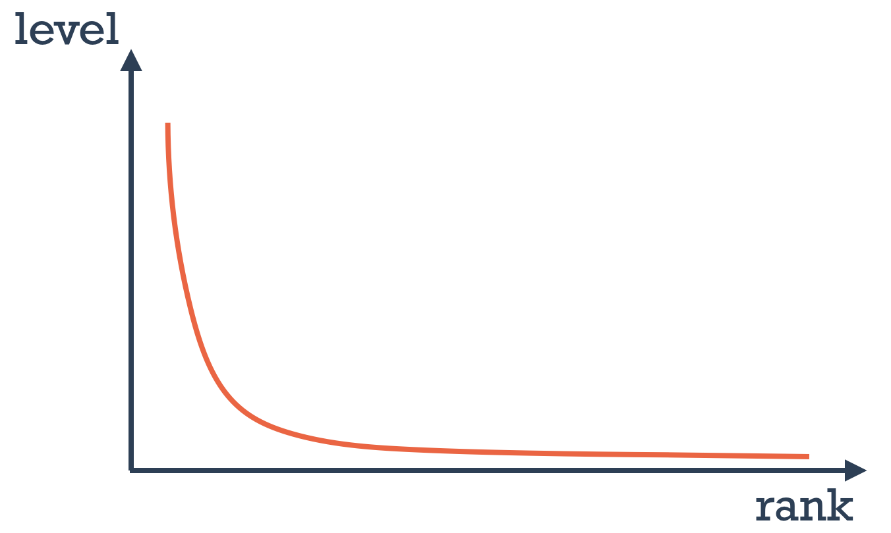
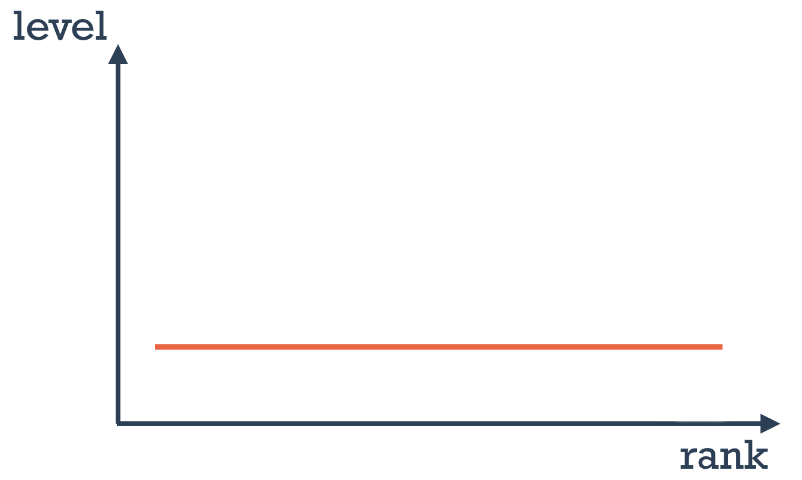

# Applying LRU cache in ASP NET Core applications

## Introduction
In modern web application development, it is hard to overestimate the importance of cache. We store results for time-consuming, expensive or frequently repeating calculations in a kind of storage where calling storage is much faster and cheaper than calling origin or repeating calculations. We use RAM or optimized for fast key-value access databases such as Redis for this purpose. A cache is an ultimate tool for reducing response time and improving application scalability. But it has some limitations, which are primarily related to cache size. We will likely lack RAM or Redis storage to fully cache database table with millions of records. To mitigate cache size limitations while working with large datasets, we need to apply some kind of algorithm, which will help us to cache only data we need to cache - elements that are requested most frequently. In this article, we will consider in detail using one of such algorithms - LRU cache - in the context of ASP NET Core web applications.

This article could be useful for developers who are striving to continuously improve web application performance. Also, this article could be helpful for any web developers interested in expanding their professional toolkit.

## Description of LRU cache
The solution to our problems should match two criteria. Firstly, cache size should be limited. Secondly, the algorithm should leave in cache only the most frequently called data. It seems that LRU (Least Recently Used) cache algorithm matches our criteria.

LRU is an algorithm that works using the principle of displacement of least recently used elements from the limited size cache. Implementation is often represented as a double-linked list and hash table. Hash-table provides fast access to the element by key (with the help of hash table data access usually takes constant time). As a value hash-table contains a reference to a double-linked list item, which includes references to prev, next and value itself. If we have found an element by key in the hash-table, we move the value to the head of the double-linked list (this operation is fast because we only need to reassign prev and next references), while other elements in the cache are automatically moved down. This way, at the tail of the list we always have the least recently used element. On adding a new element, if cache size is exceeded, the last item in the double-linked list is removed, maintaining maximum cache size.

It is usually better to understand how LRU works with illustrations:


There are two main pitfalls in using LRU cache. Firstly, we need two data structures for LRU cache, which consumes more memory. Secondly, LRU cache while operating is continuously changing both data structures and the need for synchronization in a multithreaded environment arises. This is usually solved by wrapping all access code into a `lock` statement, which causes some performance overhead.

In standard C# libraries there is no default LRU cache implementation, but after some searching, we can discover `LRUCache` class in [Microsoft Bot Framework SDK](https://github.com/microsoft/botbuilder-dotnet/blob/402bc02b4cbbd2f4ec359134640e99211367e4a5/libraries/AdaptiveExpressions/LRUCache.cs) repository. We can use this implementation in the article with some minor changes for adding expiration support.

## Attempting to use LRU cache directly
Looking ahead, I note that the most efficient use of the LRU cache will require some preparatory work. But for demonstration purposes, let's try to apply LRU cache directly and see what results we will receive.

For demo purposes, we will use ASP NET Core with Entity Framework application, the single option of which will be returning products from the database. We will have one million DB records, 10 000 (1%) of which will be requested more often [according to the script](https://github.com/MrPomidor/SmartCachingDemo/blob/master/src/Solution/Testing/LoadTest/Program.cs). As a load testing tool for checking cache efficiency we will use [NBomber](https://medium.com/@anton_shyrokykh/nbomber-as-an-alternative-to-jmeter-for-net-developer-432040b91763).

```csharp
[Route("api/products")]
public class ProductsController : Controller
{
    private readonly ProductsContext _dbContext;
    private readonly IProductsCache _productsCache;
    ...
    [HttpGet("{id:long}")]
    public async Task<IActionResult> GetProduct(long id, CancellationToken cancellationToken = default)
    {
        var product = await _productsCache.TryGet(id);
        if (product != null)
            return Ok(product);

        product = await _dbContext.Products.AsNoTracking().FirstOrDefaultAsync(x => x.Id == id, cancellationToken);
        if (product == null)
            return NotFound();

        await _productsCache.Set(id, product);
        return Ok(product);
    }
}
```

Let's perform two tests: the first will be the control one without using the cache, second with [slightly modified LRU cache implementation](https://github.com/MrPomidor/SmartCachingDemo/blob/master/src/Solution/APIs/Reusables/Caching/InMemory/LRUCache.cs) with capacity 5000. 5000 is a randomly taken number, which, as we know, is less than the often requested elements set size. Let's see the results:

|Cache type|Often requested items mean (ms)|Other items mean (ms)|Total RPS|
|---|---|---|---|
|No Cache|194,93|196,00|5000|
|In Memory LRU Cache (5000)|164,53|178,97|5000|

As we can see, applying LRU cache directly without preparation could have some positive effect on average response time, but this is far from its limit. Also worth noting that being not so lucky in choosing initial cache capacity and with a greater spread of often requested items we could get results worse than with no-cache. To make decisions consciously, we need to be more informed on how LRU cache works with different inputs. Let's make an analysis.

## Impact of LRU cache size on its efficiency
The metric by which we usually can judge cache efficiency is the ratio of "matches", when requested elements were present in the cache, to "misses", when requested elements were not found in the cache. By getting this ratio, we can make a conclusion on cache efficiency and also see if the most important elements "stay" in the cache for enough time. To collect this info let's add several event-counters to `LRUCache` class and repeat a test to collect data with the help of [the utility](https://github.com/MrPomidor/SmartCachingDemo/tree/master/src/Solution/Testing/CountersMonitor). Event-counters is a tool for emitting real-time application metrics with minimal overhead, so developer could easily add and consume own metrics (to get more info on event-counters you can visit [this article](https://medium.com/criteo-engineering/net-core-counters-internals-how-to-integrate-counters-in-your-monitoring-pipeline-5354cd61b42e)). Let's add metrics for `TryGet` and `Set` methods and test again.

|Metric|Value|
|---|---|
|Total requests|890000|
|Matches|101242|
|Miss|788758|
|Efficiency rate (match/miss)|0,1283|

By analyzing result data, we can conclude that for a cache with size of 5000 elements for each "match" we have approximately eight "misses". Not quite impressive. Let's try to illustrate how insufficient LRU cache size could influence its effectiveness with the next scheme:


When cache size is insufficient, the flow of rare requested elements displaces often requested elements from the cache. So to increase LRU cache efficiency, we need to choose the correct size to keep the required elements in cache for enough time. Also, keep in mind resource limitations. Let's make a note regarding the correct cache size and continue our analysis.

## Elements popularity distribution as LRU cache efficiency factor
As follows from LRU cache description, least recently used elements are displaced by often requested elements, meaning only needed items should stay in the cache. Several questions can arise. How often must one part of the elements be requested compared to the other part for the LRU cache to work effectively ? Will the LRU cache be efficient if all items are requested at the same frequency ? In other words, what elements popularity distribution should look like ?

By doing some search I've found a single source answering this question. As follows from [Redis documentation](https://redis.io/docs/manual/eviction/) (we will consider Redis-based distributed version of LRU cache later in this article):

> Use the allkeys-lru policy when you expect a power-law distribution in the popularity of your requests. That is, you expect a subset of elements will be accessed far more often than the rest.




As a special case of power-law distribution we can consider Pareto distribution. Adapting Pareto distribution description to our case, we can get the best option for element popularity distribution: 20% of data should generate 80% of requests. As the worst option for using LRU cache, we can take a uniform distribution when elements are requested equally frequent.

Now we know that before applying LRU cache we should be sure that elements popularity distribution should approach Pareto distribution. We need to collect distribution data to determine if it is appropriate to use the LRU cache for our resources. We will collect this data using the next approach: firstly, we need `ConcurrentDictionary` where we will store and update resources call frequency data, `BackgroundService` which will aggregate values, calculate statistics and reset data, and event-counters to emit these statistics so we can consume it out-of-proc using [our utility](https://github.com/MrPomidor/SmartCachingDemo/tree/master/src/Solution/Testing/CountersMonitor). Let's test our application without cache to collect elements popularity distribution data during several minutes.

```csharp
public class ProductsStatsAggregator
{
    private ConcurrentDictionary<long, int> _stats;
    ...
    public void ProductRequested(long productId)
    {
        _stats.AddOrUpdate(productId, 1, (key, oldValue) => oldValue + 1);
    }
    ...
}
```

|Items from total (percent)|Requests (percent)|
|---|---|
|5% of items|60,31|
|10% of items|69.91|
|15% of items|75,47|
|20% of items|81,02|

According to the results, a small portion of data is requested significantly more often than others. Popularity distribution for our application is closer to Pareto distribution than to uniform one. That's why applying LRU cache could be effective in our case. I think we get enough data to make some conclusions for our analysis.

## Choosing a mathematical model for LRU cache
We have performed a shallow analysis of an attempt to apply LRU cache, and as a result, we have two recommendations. Firstly, for LRU cache being effective, cache size should be big enough. Secondly, elements popularity distribution should approach Pareto distribution. The first recommendation sounds good, but what does it mean "big enough" ?

To get a good answer, we should ask a good question, so let's define it. We need cache size to be big enough so that often requested elements can be kept for long enough to be requested more than two times for the cache to be effective. Transforming the statement: cache size should provide a high enough **probability** of repeated "match" for often requested elements. We have the word **probability**, so let's check if probability theory can help us. We can represent a "match" of the often requested element as an independent event $A$ with probability $p$. Cache size could be considered as a number of independent tests $n$. So probability of $k$ "matches" is $P_n(k)$. This looks like a repeated independent test scheme or Bernoulli scheme:

$$P_n(k) = C_n^k * p^k * q^{n-k}, q = 1 - p$$

Bernoulli formula by itself is not much useful for us, but if we can apply Bernoulli scheme, we also can use the formula for the most probable number of events. This sounds like exactly what we need and by slightly modifying the formula we can get a number of tests (cache size) for the desired number of events (we need more than two matches).

$$np - (1 - p) < T < np + (1 - p)$$

$$
\begin{cases}
np - (1 - p) < T \\
np + (1 - p) > T
\end{cases}
$$

$$
\begin{cases}
n < {T + (1-p) \over p} \\
n > {T - (1-p) \over p}
\end{cases}
$$

For applying the formula we only miss probability $p$ of independent event $A$ - the probability of the often requested element to "match" the cache. Luckily, we can easily get this probability from elements popularity distribution data we collected before using event-counters. Worth noting that we will make the calculation using real distribution data we get from our application.

$$p = n_1*p_1$$
$$n_1 = {N*P \over 100}$$
$$p_1 = { p * 100 \over N * P }$$

$p$ - probability of often requested elements "match" (from distribution table - 81.027)

$p_1$ - probability of concrete item from often requested items set "match" (**this is what we should find** to apply in a most probable number of events formula)

$n_1$ - amount of often requested items

$N$ - total items (for our case it is total products stored in DB - 1 000 000)

$P$ - percent of often requested items from the total items amount (according to our distribution table - 20)

$$p_1 = { 81.027 * 100 \over 1000000 * 20 } = 0.0004051$$

After getting all inputs, let's calculate LRU cache size, which will be effective for providing amount of "matches" more than two.

|Desired matches count|Estimated cache size|
|---|---|
|3|4938-9873|
|4|7406-12341|

As we concluded before and based on formulas, the larger is LRU cache size, the more effective it is. For the test, let's take the maximum value we've got from applying formulas and round it to 13 000. Also, let's take a larger cache size of 15 000 as well to see the difference. Let's run a test to collect "match"/"miss" and average response time stats.

|Cache type|Cache size|Often requested items mean (ms)|Other items mean (ms)|Efficiency rate (match/miss)|
|---|---|---|---|---|
|No Cache|-|194,93|196|-|
|In Memory LRU Cache|5000|164,53|178,97|0,1283|
|In Memory LRU Cache|13000|143,02|174,96|0,3647|
|In Memory LRU Cache|15000|115,66|145,96|0,4267|

From test results we can conclude that applying LRU cache with the correct size and after good preparations can result in significant performance growth. Also, good effectiveness is confirmed by "match"/"miss" rates. To demonstrate that our application became more scalable and load resistant, let's repeat the test with higher RPS.

|Cache type|Often requested items mean (ms)|Other items mean (ms)|RPS|
|---|---|---|---|
|No Cache|194,93|196,00|5000|
|No Cache|241,21|245,21|5400|
|In Memory LRU Cache (15000)|115,66|145,96|5000|
|In Memory LRU Cache (15000)|128,65|164,74|5400|

## Distributed LRU cache
We have considered using an in-memory LRU cache, which should match well for a system with one application instance. But what if we have a distributed system with many instances of the same application running ? In this case using in-memory LRU cache will be difficult due to load balancer requests distribution. We need elements tracking and displacement logic to be centralized. Luckily, Redis has build-in support for LRU eviction algorithm and you can configure it in two steps:

1. Set memory limit with CONFIG command:

```
CONFIG SET maxmemory 200mb
```

2. Define LRU as key eviction policy:

```
CONFIG SET maxmemory-policy allkeys-lru
```

Let's substitute our cache implementation with [Redis-based](https://github.com/MrPomidor/SmartCachingDemo/blob/master/src/Solution/APIs/Reusables/Caching/Redis/ProductsRedisCache.cs) (we need just to substitute `IProductsCache` with another implementation) and run a load test.

|Cache type|Often requested items mean (ms)|Other items mean (ms)|
|---|---|---|
|No Cache|194,93|196,00|
|Redis LRU Cache|140,11|174,24|

As we can see, distributed Redis-based version of LRU cache also improves our application performance.

## Considering memory limitations
Remember that the main reason for using cache with displacement algorithm is limited system resources, especially memory. Suppose, as a result of request popularity distribution analysis, you have decided that applying LRU cache makes sense and you with the help of formulas have calculated minimum effective cache size. In that case, you also can calculate in advance how much memory it will take to support a cache of this size and if it matches your system resources limitations.

For calculating in-memory cache memory consumption we can write a simple console application:

```csharp
static void Main(string[] args)
{
    const int capacity = 20_000;

    var faker = ProductsContextSeeder.GetFaker();
    var items = faker.Generate(capacity);
    var lruCache = new LRUCache<long, Product>(capacity, TimeSpan.FromHours(1));
    foreach (var item in items)
    {
        lruCache.Set(item.Id, item);
    }

    faker = null;
    items = null;

    var memoryBeforeBytes = GC.GetTotalMemory(true);

    lruCache.ToString();
    lruCache = null;

    var memoryAfterBytes = GC.GetTotalMemory(true);

    Console.WriteLine(@$"Testing memory consumption for LRU cache with Product entity with capacity {capacity}:
        Memory before cleanup: {memoryBeforeBytes * BToMb} MB ({memoryBeforeBytes} BYTES)
        Memory after cleanup: {memoryAfterBytes * BToMb} MB ({memoryAfterBytes} BYTES)
        Approximate items size: {(memoryBeforeBytes - memoryAfterBytes) * BToMb} MB ({memoryBeforeBytes - memoryAfterBytes} BYTES)
    ");

    Console.WriteLine("Press any key ...");
    Console.ReadKey();
}
```

For calculating Redis cache memory consumption we can use similar approach and write an integration test:

```csharp
[Theory]
[InlineData(20_000)]
public async Task RedisMemoryConsumption(int elementsCount)
{
    // arrange
    await _redisManager.ClearCache();
    var productsCache = new ProductsRedisCache(new SystemTextJsonSerializer(), _redisManager);

    var faker = ProductsContextSeeder.GetFaker();
    var items = faker.Generate(elementsCount);

    var usedMemoryBeforeBytes = await _redisManager.GetUsedMemoryBytes();

    // act
    await Parallel.ForEachAsync(items, async (item, _) =>
    {
        await productsCache.Set(item.Id, item);
    });

    // assert
    var usedMemoryAfterBytes = await _redisManager.GetUsedMemoryBytes();
    Log($@"Testing memory consumption in Redis for Product entity with items count: {elementsCount}
        Used memory before: {usedMemoryBeforeBytes * BToMb} MB ({usedMemoryBeforeBytes} BYTES)
        Used memory after: {usedMemoryAfterBytes * BToMb} MB ({usedMemoryAfterBytes} BYTES)
        Approximate memory taken in Redis: {(usedMemoryAfterBytes - usedMemoryBeforeBytes) * BToMb} MB ({usedMemoryAfterBytes - usedMemoryBeforeBytes} BYTES)
    ");

    // cleanup
    await _redisManager.ClearCache();
}
```

This way you can receive more data which will help you to make an informed decision.

## Recommendations for optimal usage of LRU cache
Let's make a summary and form some action plan, following which you can make the right decision about applying or not applying LRU cache in your application.

0. Make initial system measurements with load testing to define if you have a performance bottleneck or problem to be solved and record starting point stats before starting optimization.
1. Gather request popularity distribution stats on real application to determine the appropriateness of using LRU cache. For LRU cache to be effective, the distribution must approach the Pareto distribution (20% of elements generate 80% of requests).
2. By using distribution data, calculate the minimum effective LRU cache size using the most probable number of events formula. Amount of matches should be greater than two (three, four or more).
3. Calculate the amount of memory consumed by LRU cache of such size and make sure it matches your limitations (server RAM or Redis subscription).
4. Implement LRU cache in your application
5. Perform load testing by emulating real request distribution. Analyse "match"/"miss" rate.
6. Test on a prod-like (or prod) environment.

## Bonus content: code that can be useful for you
In this article, we have considered the nuances of using the LRU cache in web applications, and, as for me, we did it with enough level of detalization. Demo applications used in this article, docker-compose configuration, load test scenarios and other code are available on [GitHub](https://github.com/MrPomidor/SmartCachingDemo). However, I would consider this article incomplete without including the description of some code from the repository, which could potentially be useful for you in terms of LRU cache topic.

[**Helper unit tests for formulas calculations**](https://github.com/MrPomidor/SmartCachingDemo/blob/master/src/Solution/Testing/UnitTests.Math/Probabilities.cs). While working on this article, I have written some unit tests, for simplifying experimenting with different inputs: calculating cache size for known desired "matches" count, calculating the probability of often requested item appearance with known total items count, calculating most possible "matches" count with different inputs etc. By using these unit tests, you can easily test needed values and receive fast feedback.

[**Utility for out-of-proc consuming of event-counters**](https://github.com/MrPomidor/SmartCachingDemo/tree/master/src/Solution/Testing/CountersMonitor). Usually, for reading application metrics from event-counters you need a `dotnet-counters` console tool, but it is quite straightforward and it just displays real-time metrics values as they are emitted by an application. To be able to control emitted values, to aggregate and handle them, in terms of work on this article a utility tool was written. This utility reuses source code from `dotnet counters ps` command, to find the process we need by name, and from `dotnet counters monitor` command, to get access to counter values. The utility consists of three parts: `ProcessFetcher` to get Id of the required process, `StatsCollector` for collecting metrics and `StatsHandler` for handling collected information. The code could be useful if you need to read and process data from event-counters.

**Utility code measuring memory consumption**. As we concluded before, to make the right decision on using LRU cache, you also need to know if the effective cache size matches your resource limitations. In the repository there is a code dedicated to finding the answer to this question for [in-memory implementation](https://github.com/MrPomidor/SmartCachingDemo/blob/master/src/Solution/Testing/MemoryConsumptionTest/Program.cs) and [Redis-based implementation](https://github.com/MrPomidor/SmartCachingDemo/blob/master/src/Solution/Testing/UnitTests/RedisMemoryConsumptionTest.cs) as well.

I hope this article and the materials attached to it were useful to you.

Thank you for your attention !