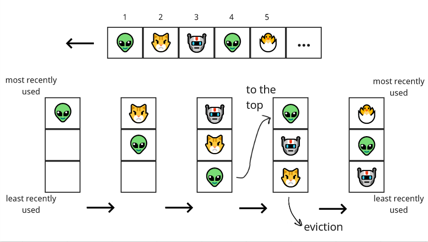
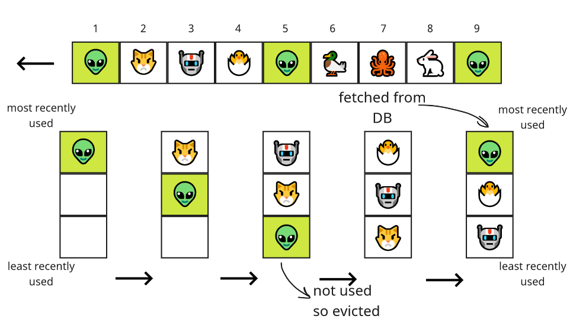

# Особенности применение LRU кэша в ASP NET Core веб приложениях

## Вступление
В современной веб разработке сложно переоценить значение такого инструмента как кэш. Мы сохраняем результаты выполнения длительных, дорогостоящих или часто выполняемых операций в некое хранилище, обратиться к которому будет быстрее и дешевле чем к первоисточнику или дешевле чем повторять операцию. В качестве такого хранилища обычно выступает оперативная память или же оптимизированные для быстрого доступа по ключу базы данных, такие как Redis. Кэш это незаменимый инструмент для уменьшения времени отклика и повышения масштабируемости приложения. Однако он имеет свои ограничения, которые связаны в основном с размером кэша. У нас не хватит оперативной памяти и пространства в Redis чтобы полностью закешировать таблицу базы данных с миллионами записей. Для решения проблемы использования кэша при большом объеме исходных данных и ограниченных ресурсах, мы должны применить некий алгоритм, который позволит нам кешировать только самое необходимое - часто запрашиваемые элементы. В этой статье мы детально рассмотрим применение одного из таких алгоритмов кэширования - LRU в контексте ASP NET Core приложения.

Эта статья может быть полезна разработчикам, которые ищут пути повышения производительности веб приложения, а также всем разработчикам, заинтересованным в расширении своего профессионального инструментария.

## Описание работы LRU кэша 
Итак, решение нашей проблемы должно отвечать двум критериям: во-первых, кэш должен иметь ограниченный размер, во-вторых, алгоритм должен сохранять в кэше только наиболее часто запрашиваемую информацию. Под это описание отлично подходит алгоритм под названием Least Recently Used (LRU) Cache.

LRU это алгоритм, который работает по принципу вытеснения наименее часто используемого (least recently used) элемента в кэше с ограниченным размером. Реализация часто представляет собой двухсвязный список и хэш-таблицу. Хэш-таблица нужна для быстрого доступа к элементу по ключу (благодаря использованию хэш-таблицы доступ к любому элементу происходит за константное время). В качестве значения хэш-таблица содержит ссылку на элемент двухсвязного списка, который содержит ссылки на prev и next, а также само значение. Если запрашиваемый элемент найден по ключу в хэш-таблице, он перемещается в head двухсвязного списка (это происходит быстро, так как нужно просто переприсвоить указатели на prev и next), при этом все остальные элементы сдвигаются вниз. Таким образом внизу списка всегда оказывается самый редко запрашиваемый элемент. При добавлении нового элемента, если размер кэша превышен, последний элемент в двухсвязном списке удаляется, поддерживая таким образом ограниченный размер. 

Принцип работы LRU кэша лучше усваивается с иллюстрациями:



Выделяют два основных недостатка LRU кэша: во-первых, для LRU кэша нужны две структуры данных, что увеличивает занимаемую память, во-вторых, LRU кэш во время работы изменяет обе структуры данных и возникает необходимость в поддержке согласованности в многопоточной среде, что решается оборачиванием всего кода в lock, что в свою очередь создает дополнительные накладные расходы.

В стандартных C# библиотеках нет имплементации LRU кэша, однако если немного поискать, то можно обнаружить класс `LRUCache` в репозитории [Microsoft Bot Framework SDK](https://github.com/microsoft/botbuilder-dotnet/blob/402bc02b4cbbd2f4ec359134640e99211367e4a5/libraries/AdaptiveExpressions/LRUCache.cs). Немного модифицировав этот код, добавив поддержку expiration-а, мы будем использовать его в наших демонстрациях далее в этой статье.

## Попытка применение LRU кэша в лоб
Забегая наперед отмечу что максимально эффективное применение LRU кэша потребует некоторой подготовительной работы. Но в целях демонстрации мы попытаемся применить LRU кэш в лоб и посмотрим что из этого получится. 

Для теста мы напишем ASP NET Core приложение с Entity Framework, единственной функцией которого будет возвращать продукты из базы данных. Количество продуктов в базе у нас будет один миллион, из которых [по сценарию](https://github.com/MrPomidor/SmartCachingDemo/blob/master/src/Solution/Testing/LoadTest/Program.cs) 10 000 (1%) запрашиваются чаще чем другие. В качестве инструмента нагрузочного тестирования для проверки эффективности кэша мы будем использовать [NBomber](https://habr.com/ru/post/664824/).

```csharp
[Route("api/products")]
public class ProductsController : Controller
{
    private readonly ProductsContext _dbContext;
    private readonly IProductsCache _productsCache;
    ...
    [HttpGet("{id:long}")]
    public async Task<IActionResult> GetProduct(long id, CancellationToken cancellationToken = default)
    {
        var product = await _productsCache.TryGet(id);
        if (product != null)
            return Ok(product);

        product = await _dbContext.Products.AsNoTracking().FirstOrDefaultAsync(x => x.Id == id, cancellationToken);
        if (product == null)
            return NotFound();

        await _productsCache.Set(id, product);
        return Ok(product);
    }
}
```

Проведем два теста: первый контрольный без использования кэша, второй с использованием [доработанной имплементации `LRUCache`](https://github.com/MrPomidor/SmartCachingDemo/blob/master/src/Solution/APIs/Reusables/Caching/InMemory/LRUCache.cs). В качестве capacity возьмем наугад число 5000, что меньше чем предполагаемый размер выборки часто запрашиваемых элементов. Посмотрим на результаты.

|Cache type|Often requested items mean (ms)|Other items mean (ms)|Total RPS|
|---|---|---|---|
|No Cache|194,93|196,00|5000|
|In Memory LRU Cache (5000)|164,53|178,97|5000|

Как видим, применение кэша в лоб в нашем случае помогло уменьшить среднее время отклика, но поверьте это не предел и при должной конфигурации приложение может достичь большего прироста. А в случае менее удачных вводных, например при большем разбросе часто запрашиваемых элементов, результаты при данном размере кэша наоборот могут ухудшиться. Чтобы принимать решения осознанно, нам необходимо собрать больше информации, проведя анализ.

## Влияние размера LRU кэша на эффективность
Одна из мер эффективности кэша это соотношение "попаданий", когда запрошенный элемент присутствовал в кэше, к числу "промахов", когда запрашиваемый элемент не был найден в кэше. Получив это соотношение мы сможем понять "задерживаются" ли нужные элементы в кеше достаточно долго, чтобы быть переиспользованными. Для сбора этой информаций добавим несколько event counter-ов в класс `LRUCache`, и повторив тест соберем данные с помощью [утилиты для сбора статистики](https://github.com/MrPomidor/SmartCachingDemo/tree/master/src/Solution/Testing/CountersMonitor). Event counter-ы представляют из себя инструмент для сбора метрик приложения в реальном времени с минимальными накладными расходами, где разработчик может легко добавлять и получать собственные метрики (подробнее об этом инструменте можно прочесть в [этой статье](https://habr.com/ru/post/595041/)). Добавим метрики в методы `TryGet` и `Set` и повторим тест.

|Metric|Value|
|---|---|
|Total requests|890000|
|Matches|101242|
|Miss|788758|
|Efficiency rate (match/miss)|0,1283|

Проанализировав полученные данные, мы узнали что для размера кэша в 5000 элементов на каждое "попадание" следует примерно восемь "промахов". Не очень высокий результат. Попробуем проиллюстрировать как недостаточный размер LRU кэша может повлиять на его эффективность с помощью схемы: 



При недостаточном размере кэша, поток редко запрашиваемых элементов вытесняет часто запрашиваемые элементы из кэша. Таким, образом чтобы повысить эффективность работы LRU кэша, нам необходимо выбрать правильный размер, который будет достаточным чтобы нужные элементы "задерживались" в кэше. Однако стоит помнить и об ограниченных ресурсах. Запишем пункт про правильный размер кэша в наш список улучшений и продолжим анализировать.

## Распределение популярности запросов как фактор эфективности LRU кэша
Как мы выяснили ранее, в LRU кэше вытесняются наименее часто используемые элементы, что означает что в кеше должны оставаться те элементы, которые запрашиваются чаще всего. Возникает ряд вопросов. Насколько чаще одна часть элементов должна быть запрошена, чтобы LRU кэш работал эффективно ? Будет ли LRU кэш эффективен, если все элементы запрашиваются с одинаковой частотой ? Иными словами, какое должно быть распределение популярности запросов ?

Проведя поиск, я нашел единственный источник, который содержит ответ на этот вопрос. Источник, [онлайн документация к Redis](https://redis.io/docs/manual/eviction/) (распределенный вариант LRU кэша на базе Redis мы рассмотрим позже в этой статье), гласит:

> Use the allkeys-lru policy when you expect a power-law distribution in the popularity of your requests. That is, you expect a subset of elements will be accessed far more often than the rest.


В качестве частного случая распределения по степенному закону (power-law distribution) можно выделить распределение Парето. Адаптируя описание распределения Парето под наш тест, мы можем выделить лучший для нас вариант распределения популярности запросов для применения LRU кэша: 20% данных должны генерировать 80% запросов. В качестве худшего сценария для применения LRU кэша выступит равномерное распределение (uniform distribution), при котором все элементы запрашиваются одинаково часто.

Теперь мы знаем что перед применением LRU кэша, мы должны убедится что распределение популярности запросов должно приближаться к распределению Парето. Нам необходимо собрать данные о распределении, чтобы определить целесообразно ли использование LRU кэша для нашего ресурса. Для этого нам понадобится `ConcurrentDictionary`, в который мы будем записывать и обновлять частоту запросов данных, `BackgroundService`, который через определенные промежутки времени будет сбрасывать счетчики и проводить вычисления, и event counters, через которые мы сможем получать статистику извне приложения с помощью [нашей утилиты](https://github.com/MrPomidor/SmartCachingDemo/tree/master/src/Solution/Testing/CountersMonitor). Проведем повторный тест приложения без кэша, собрав статистику распределения популярности запросов в течение нескольких минут.

```csharp
public class ProductsStatsAggregator
{
    private ConcurrentDictionary<long, int> _stats;
    ...
    public void ProductRequested(long productId)
    {
        _stats.AddOrUpdate(productId, 1, (key, oldValue) => oldValue + 1);
    }
    ...
}
```

|Items from total (percent)|Requests (percent)|
|---|---|
|5% of items|60,31|
|10% of items|69.91|
|15% of items|75,47|
|20% of items|81,02|

Согласно полученным результатам, небольшая часть ресурсов запрашивается значительно чаще чем остальные. Распределение популярности запросов для нашего приложения гораздо ближе к распределению Парето, чем к равномерному распределению. Поэтому применение LRU кэша в нашем приложении может быть эффективным. Думаю теперь у нас достаточно информации для подведения итогов анализа.

## Выбор математической модели для LRU кэша
Итак, мы провели поверхностный анализ попытки применения LRU кэша и смогли выделить две рекомендации: во-первых, для эффективной работы размер LRU кэша должен быть достаточным, во-вторых, распределение популярности запросов должно приближаться к распределению Парето. Первая рекомендация звучит логично, но фраза "достаточный размер" по сути ничего конкретного нам не говорит. 

Чтобы получить хороший ответ, нужно правильно задать вопрос, поэтому определим задачу. Нам необходимо чтобы размер кэша был настолько большой, чтобы часто запрашиваемые элементы могли задерживаться в нем достаточно долго, чтобы быть переиспользованными больше двух раз. Немного перефразируем: Размер кэша должен обеспечивать высокую **вероятность** повторного "попадания" для часто запрашиваемых элементов. Если прозвучало слово **вероятность**, сможет ли нам помочь теория вероятности ? Мы можем представить "попадание" часто запрашиваемого элемента как независимое событие $A$ с вероятностью $p$, а размер кэша как количество независимых испытаний $n$. Тогда искомая вероятность $k$ количества "попаданий" это $P_n(k)$. Это очень похоже на схему повторных независимых испытаний или схему Бернулли:  

$$P_n(k) = C_n^k * p^k * q^{n-k}, q = 1 - p$$

Формула Бернулли сама по себе для нас мало полезна, однако распределение по схеме Бернулли позволяет использовать формулу наивероятнейшего числа успехов. Это звучит как то что нам нужно и немного модифицировав формулу мы сможем вычислить количество испытаний (размер кэша) по желаемому наивероятнейшему числу успехов (больше 2-х).

$$np - (1 - p) < T < np + (1 - p)$$

$$
\begin{cases}
np - (1 - p) < T \\
np + (1 - p) > T
\end{cases}
$$

$$
\begin{cases}
n < {T + (1-p) \over p} \\
n > {T - (1-p) \over p}
\end{cases}
$$

Для применения формулы нам не хватает только вероятности $p$ независимого события $A$ - вероятности того что часто запрашиваемый элемент "попадет" в кэш. К счастью, с помощью данных по распределению популярности запросов мы можем легко найти эту вероятность, что важно - опираясь на реальные данные нашего приложения.

$$p = n_1*p_1$$
$$n_1 = {N*P \over 100}$$
$$p_1 = { p * 100 \over N * P }$$

$p$ - вероятность попадания элемента из числа часто запрашиваемых (из полученной таблицы распределений - 81.027)

$p_1$ - вероятность попадания конкретного часто запрашиваемого элемента

$n_1$ - количество часто запрашиваемых элементов

$N$ - общее количество элементов (для нас это общее количество продуктов в БД - 1 000 000)

$P$ - процент группы часто запрашиваемых элементов от общего количества элементов (согласно таблице распределений - 20)

$$p_1 = { 81.027 * 100 \over 1000000 * 20 } = 0.0004051$$

Получив все вводные и выполнив расчеты мы можем определить минимальный эффективный размер LRU кэша для того чтобы элемент попадал в кэш больше 2-х раз.

|Desired matches count|Estimated cache size|
|---|---|
|3|4938-9873|
|4|7406-12341|

Как мы выяснили ранее и как следует из формул, чем больше размер LRU кэша, тем больше он эффективен. Для повторного теста возьмем максимальное полученное значение и округлим его до 13 000, а также отдельно протестируем больший размер кэша в 15 000. Выполним тест, повторно собрав статистику по "попаданиям" и среднему времени ответа.

|Cache type|Cache size|Often requested items mean (ms)|Other items mean (ms)|Efficiency rate (match/miss)|
|---|---|---|---|---|
|No Cache|-|194,93|196|-|
|In Memory LRU Cache|5000|164,53|178,97|0,1283|
|In Memory LRU Cache|13000|143,02|174,96|0,3647|
|In Memory LRU Cache|15000|115,66|145,96|0,4267|

По результатам теста мы можем сказать что в этот раз применение LRU кэша с правильно подобранным размером и хорошо проведенной подготовительной работой позволило нам добиться значительного улучшения производительности. Также эффективность новой конфигурации подтверждают метрики по соотношению "попаданий" к "промахам". 

Чтобы продемонстрировать что наше приложение стало значительно более устойчивым к нагрузкам благодаря использованию LRU кэша проведем тестирование при большем RPS.

|Cache type|Often requested items mean (ms)|Other items mean (ms)|RPS|
|---|---|---|---|
|No Cache|194,93|196,00|5000|
|No Cache|241,21|245,21|5400|
|In Memory LRU Cache (15000)|115,66|145,96|5000|
|In Memory LRU Cache (15000)|128,65|164,74|5400|

## Использование распределенного LRU кэша
Мы рассмотрели применение in-memory варианта LRU кэша, который подходит для одного экземпляра приложения. Но что если у вас распределенная система с множеством экземпляров ? В этом случае использование in-memory LRU будет затруднено из-за распределения запросов load-balancer-ом. Необходимо чтобы логика отслеживания элементов в кэше и логика вытеснения редко используемых элементов была централизованной. К счастью, Redis имеет встроенную поддержку LRU алгоритма и его достаточно легко настроить. Для использования LRU алгоритма в Redis необходимо выполнить два шага:

1. Выставить лимит на использование памяти с помощью команды CONFIG:

```
CONFIG SET maxmemory 200mb
```

2. Определить LRU как алгоритм работы с кэшем (key eviction policy):

```
CONFIG SET maxmemory-policy allkeys-lru
```

Заменим реализацию кэша в нашем приложении на [Redis](https://github.com/MrPomidor/SmartCachingDemo/blob/master/src/Solution/APIs/Reusables/Caching/Redis/ProductsRedisCache.cs) (нам всего лишь необходимо заменить реализацию `IProductsCache`) и проведем нагрузочное тестирование.

|Cache type|Often requested items mean (ms)|Other items mean (ms)|
|---|---|---|
|No Cache|194,93|196,00|
|Redis LRU Cache|140,11|174,24|

Как мы можем видеть, распределенная версия LRU кэша на базе Redis тоже повышает производительность приложения.

## Работа с ограничениями по памяти
Как мы помним, основная причина использования кэша с алгоритмом вытеснения и ограниченным размером - это ограниченные ресурсы, в частности память. Если до начала имплементации в результате анализа распределения популярности запросов вы пришли к выводу, что применять LRU кэш целесообразно и вы с помощью формул вычислили минимально эффективный размер кэша, у вас также есть возможность заранее рассчитать сколько памяти займет ваш кэш и укладывается ли размер кэша в ваши ограничения. 

Для вычисления размера кэша in-memory мы можем написать простое консольное приложение:

```csharp
static void Main(string[] args)
{
    const int capacity = 20_000;

    var faker = ProductsContextSeeder.GetFaker();
    var items = faker.Generate(capacity);
    var lruCache = new LRUCache<long, Product>(capacity, TimeSpan.FromHours(1));
    foreach (var item in items)
    {
        lruCache.Set(item.Id, item);
    }

    faker = null;
    items = null;

    var memoryBeforeBytes = GC.GetTotalMemory(true);

    lruCache.ToString();
    lruCache = null;

    var memoryAfterBytes = GC.GetTotalMemory(true);

    Console.WriteLine(@$"Testing memory consumption for LRU cache with Product entity with capacity {capacity}:
        Memory before cleanup: {memoryBeforeBytes * BToMb} MB ({memoryBeforeBytes} BYTES)
        Memory after cleanup: {memoryAfterBytes * BToMb} MB ({memoryAfterBytes} BYTES)
        Approximate items size: {(memoryBeforeBytes - memoryAfterBytes) * BToMb} MB ({memoryBeforeBytes - memoryAfterBytes} BYTES)
    ");

    Console.WriteLine("Press any key ...");
    Console.ReadKey();
}
```

Для вычисления размера кэша в Redis используем похожий подход и напишем юнит тест:

```csharp
[Theory]
[InlineData(20_000)]
public async Task RedisMemoryConsumption(int elementsCount)
{
    // arrange
    await _redisManager.ClearCache();
    var productsCache = new ProductsRedisCache(new SystemTextJsonSerializer(), _redisManager);

    var faker = ProductsContextSeeder.GetFaker();
    var items = faker.Generate(elementsCount);

    var usedMemoryBeforeBytes = await _redisManager.GetUsedMemoryBytes();

    // act
    await Parallel.ForEachAsync(items, async (item, _) =>
    {
        await productsCache.Set(item.Id, item);
    });

    // assert
    var usedMemoryAfterBytes = await _redisManager.GetUsedMemoryBytes();
    Log($@"Testing memory consumption in Redis for Product entity with items count: {elementsCount}
        Used memory before: {usedMemoryBeforeBytes * BToMb} MB ({usedMemoryBeforeBytes} BYTES)
        Used memory after: {usedMemoryAfterBytes * BToMb} MB ({usedMemoryAfterBytes} BYTES)
        Approximate memory taken in Redis: {(usedMemoryAfterBytes - usedMemoryBeforeBytes) * BToMb} MB ({usedMemoryAfterBytes - usedMemoryBeforeBytes} BYTES)
    ");

    // cleanup
    await _redisManager.ClearCache();
}
```

Таким образом вы получите больше данных, которые помогут вам принять правильное решение.

## Рекомендации для оптимального использования LRU
Суммируя все выше сказанное, мы можем сформировать последовательность действий, выполнив которые вы сможете принять правильное решение о применении или не применении LRU кэша в вашем веб приложении.

0. Провести изначальные замеры с помощью нагрузочного тестирования, чтобы определить что имеется проблема в производительности и зафиксировать показатели до оптимизации.
1. Собрать реальную статистику по распределению популярности запросов к ресурсу, чтобы определить целесообразность применения LRU кэша. Для эффективного использования LRU распределение должно приближаться к распределению Парето (20% ресурсов генерируют 80% запросов).
2. Используя полученные данные вычислить минимальный эффективный размер кэша, применяя формулу наивероятнейшего числа попаданий. Число попаданий должно быть больше 2-х (3,4 или более).
3. Вычислить объем памяти, который займет кэш рассчитанного ранее размера, убедиться что размер занимаемой памяти (оперативной памяти сервера/Redis) приемлем.
4. Написать код для добавления LRU кэша в приложение
5. Выполнить нагрузочное тестирование, эмулируя реальное распределение популярности запросов, проанализировать статистику "попаданий" в кэш.
6. Выполнить тестирование на prod среде.

## Bonus content: репозиторий с потенциально полезным кодом
В данной статье мы, на мой взгляд, достаточно подробно рассмотрели нюансы применения LRU кэша в веб приложениях. Приложения, используемые для теста в данной статье, конфигурация docker-compose и весь использованный код доступен в [репозитории на GitHub](https://github.com/MrPomidor/SmartCachingDemo). Однако я считал бы данную статью неполной, не включив в нее описание части используемого кода из данного репозитория, который потенциально может быть полезен вам в рамках темы этой статьи.

[**Юнит тесты для вычисления формул**](https://github.com/MrPomidor/SmartCachingDemo/blob/master/src/Solution/Testing/UnitTests.Math/Probabilities.cs). Во время работы над этой статьей были написаны юнит-тесты, вычисляющие размер кэша при известном наиболее вероятном (желаемом) числе попаданий, вероятность появления часто запрашиваемого элемента при известном общем количестве элементов, а также тест вычисляющий наиболее вероятное число попаданий при разных вводных. Используя эти тесты вы сможете легко подставить во ввод интересующие вас значения и быстро получить нужные вам результаты.  

[**Улитита для out-of-proc чтения event counters**](https://github.com/MrPomidor/SmartCachingDemo/tree/master/src/Solution/Testing/CountersMonitor). Часто возникала необходимость читать значения метрик через консольный инструмент `dotnet-counters` и чтобы облегчить эту задачу и иметь возможность агрегировать и обрабатывать эти метрики была написана утилита, которая переиспользует часть исходного кода команд `dotnet counters ps` (для нахождения нужного процесса по имени) и `dotnet counters monitor`. Утилита состоит из трех частей: `ProcessFetcher` для получения Id нужного процесса, `StatsCollector` для получения и сбора статистики в объект и `StatsHandler` для обработки собранной информации. Данный код может вам пригодится, если у вас возникает необходимость читать и обрабатывать значения из event counters.

**Утилиты для измерения занимаемой памяти**. Как говорилось ранее в этой статье, чтобы принять решение об использовании LRU кэша после того как известен минимально эффективный его размер, нам необходимо знать какое количество памяти будет занимать кэш такого размера. В данном репозитории присутствуют две утилиты, которые помогут вам ответить на этот вопрос для [in-memory](https://github.com/MrPomidor/SmartCachingDemo/blob/master/src/Solution/Testing/MemoryConsumptionTest/Program.cs) и [Redis](https://github.com/MrPomidor/SmartCachingDemo/blob/master/src/Solution/Testing/UnitTests/RedisMemoryConsumptionTest.cs) имплементаций LRU кэша.

Надеюсь данная статья и приложенные к ней материалы были для вас полезны.

Спасибо за внимание !

Антон Широких