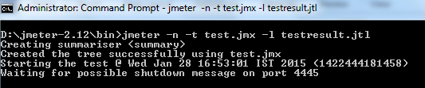

# Nbomber as an alternative to JMeter for .NET developer
Like many developers, which faced load testing first the time, I decided to start with JMeter. For familiarization purposes and small scenarios, JMeter completely satisfied me. But when tasks became more complicated, and I needed more control over scenario configuration, I started thinking about searching for a more handy alternatives. Especially wishing for a new tool to be easily adaptable to .NET ecosystem. 

In this article, we will consider NBomber as an easy-to-learn and use alternative to JMeter and try to answer the question "Why should I consider NBomber for using as a load testing tool ?".

This article could be useful for .NET developers willing to expand their toolkit with a handy tool for load testing and those who are considering alternatives to JMeter in .NET ecosystem.

## JMeter is the most popular load testing tool
JMeter, according to Google statistics, is the most popular load testing tool. It has a graphical interface as well as a console one, rich functionality, and is able to carry out almost any task. During long years of active use of JMeter, a large community and a lot of related materials and guides have appeared, where you can find answers to almost any question. This is in theory, but what in practice ?

I had to apply JMeter for simple scenarios on both commercial and pet projects. To be able to perform simple scenarios, it is enough to get familiar with several video guides on JMeter's user interface. After getting some practice, you can write simple scenarios and perform one-time load testing tasks for HTTP services easily. But as it usually happens, while tasks get more complicated, some issues can arise.

## What makes me think of an alternative ?
I'm sure that JMeter is able to solve almost all possible tasks which can appear during load testing. The question is: how much time you can spend on learning and how usage comfort is important for you. I would like to immediately point out that all of the following regarding JMeter is extremely subjective and can easily be attributed to the laziness of the author :)

### User interface
Wanna start with JMeter user interface, which from the very beginning could be considered a plus. If easy scenarios could be solved in several clicks, accessing more advanced functionality will likely require some time to search for learning materials. If JMeter is not the tool you use every day, it is highly possible that you will repeat this process in some time.

For solving some tasks, for example, authorization with JWT token, you need to do some sort of [UI programming](https://www.redline13.com/blog/2018/05/test-rest-apis-authentication-using-jmeter/). First, fill up the variable declaration form, then do the same with form for fetching value from "auth/token" response, then you need to fill-up the form for the next request etc.

### Dependency on other tools
Sometimes complicated and unfamiliar UI can encourage you to find a simpler solution using more familiar tools. For example, JMeter has built-in functionality to fill up your requests with random data. More likely that you can satisfy your needs using this functionality. But for me, as .NET developer, it is more comfortable to solve such programming tasks using C#. That's why I prefer to write data-generation code on .NET, then export data to CSV and then reuse it with JMeter data source functionality, which is much easier. This way JMeter sometimes is not a self-sufficient tool for me. 

### Code reusing and working in a team
After completing a task once, you will probably want to save JMeter scenario in a version control system for further reusing in the same project and for opening it to other developers. Also, version control system allows you to track what changes are being made to the scenario by your teammates. Sounds good, isn't it ? But in practice JMeter uses XML for storing scenarios and hardly anyone wants to read it. It will be complicated to determine the contents of the scenario and what changes your colleague wants to make to it until you load this scenario locally and open it in JMeter. It limits the usefulness of saving JMeter scenarios in a version control system.

### Continuous integration and JMeter
Working on my pet project I've created a load testing scenario and tried to add the possibility of running it in terms of nightly testing scope. Sounds possible because JMeter has a console interface ! But as for me, it is not much prettier than UI and the desire to continue studying was lost for a while:



## What is NBomber ?
Before we start considering how NBomber will handle similar use-cases, let's do a short introduction.

NBomber is an open-source F#/C# libriary, available via NuGet, which contains a set of abstractions and utilities for writing load test scenarios in C#. NBomber handles threads, load management, and collecting statistics, so you can concentrate on the test scenario itself. At its core, NBomber is somewhat similar to BenchmarkDotNet for full-fledged load testing.

After getting familiar with [documenration](https://nbomber.com/docs/overview) let's white some easy script to demonstrate an approach different from JMeter. Tasks will be similar to what we usually want using JMeter:
- configuring amount of users accessing HTTP endpoint
- getting rich statistics in average response processing time, requests per second, errors percent etc.
- getting reports in different formats, including graphs and diagrams

Code:
```csharp
using NBomber.Configuration;
using NBomber.Contracts;
using NBomber.CSharp;

using var httpClient = new HttpClient();
httpClient.BaseAddress = new Uri("http://localhost:5116");

var callDateNowStep = Step.Create("call datenow", async (context) =>
{
    var response = await httpClient.GetAsync("datenow");
    if (response.IsSuccessStatusCode)
        return Response.Ok(statusCode: (int)response.StatusCode);
    else
        return Response.Fail(statusCode: (int)response.StatusCode);
});

var scenario = ScenarioBuilder.CreateScenario("Call DateNow Api", callDateNowStep)
    .WithWarmUpDuration(TimeSpan.FromSeconds(10))
    .WithLoadSimulations(
        LoadSimulation.NewInjectPerSec(_rate: 100, _during: TimeSpan.FromMinutes(1))
    );

NBomberRunner
    .RegisterScenarios(scenario)
    .WithReportFormats(ReportFormat.Html, ReportFormat.Md)
    .Run();

Console.WriteLine("Press any key ...");
Console.ReadKey();
```

As for me, the code is quite brief and clear. You can store it in [version control system](https://github.com/MrPomidor/NBomberDemo/blob/master/Solution/Cases.CallDateNow/Program.cs) and anyone can read it, which is an advantage itself. Let's review the output format to see our execution results, graphs and statistics. Running application in console, NBomber will provide well-formatted execution statistics in the form of a table:


After choosing HTML report format, we will receive html page in "reports" folder, which contains well-looking and detailed stats for each scenario and different graphs, making information easier to understand:


At this stage, NBomber can be considered as an alternative for JMeter for some easy tasks. But let's consider trying something which is far more complicated to archive using JMeter.

## NBomber as an alternative for JMeter
Let's consider three tasks which are likely to appear while load testing HTTP API.

### Request with variable parameters count
**Task**: you need to test HTTP endpoint, which accepts array of values in query string in format "?myParameter=value1&myParameter=value2". Endpoint did not accept empty strings as values. Your CSV file consists of 3 columns, which means each data row could contain up to 3 values.

To solve this with JMeter you will first try to use "Parameters" tab in "HTTP Request" element. Define 3 parameters, each of them will read values from CSV column.


Running test and .... get BadRequest.

```csharp
app.MapGet("/daysAgo", (StringArray myParameter) =>
{
    if (myParameter.Array.Any(x => string.IsNullOrEmpty(x)))
        return Results.BadRequest();
    ...
});
```

The problem is that "HTTP Request" element when receiving empty value for parameter preserves it and passes to our API:


Can we solve this somehow using JMeter ? Of course, we can ! But in some [different way](https://loadium.com/blog/how-to-add-a-variable-number-of-parameters-in-apache-jmeter), for finding which you should spend some time and this way will probably include writing some scripts on Java, Groovy or JavaScript.

When using NBomber you could solve the problem quite fast by rewriting query string construction logic using C# language, which is more familiar to you as for C# developer:

```csharp
private static string GetQueryString()
{
    var parametersCount = Random.Shared.Next(0, 3);
    if (parametersCount == 0)
        return string.Empty;
    var parametersString = "?";
    for(int i =0; i< parametersCount-1; i++)
    {
        if (i != 0)
            parametersString += "&";
        parametersString += $"myParameter={DateTime.Now}";
    }

    return parametersString;
}

var callDateNowStep = Step.Create("call daysAgo", async (context) =>
{
    var queryString = GetQueryString();
    var response = await httpClient.GetAsync($"daysAgo{queryString}");
    ...
});
```

### Request parameters generaion
**Task**: you need to test HTTP endpoint, which caches answers for some input values. To solve this issue, you need different parameters for each request.

JMeter has several [built-in functions](https://jmeter.apache.org/usermanual/functions.html) as `Random`, `RandomDate`, `RandomString`, `UUID`. But it could hardly satisfy your needs if you need input data of special format, for example, valid name, email, telephone number, credit card etc. There exist at minimum two possible ways to solve this using JMeter: using JMeter scripting or using an external data source. First requires some knowledge and skills in JMeter, while the second requires using some external data provider service of self-written data generation application.


Using NBomber you can gain several benefits. In addition to using C# language, you are also not limited in using popular C# libraries for test data generation as [Bogus](https://github.com/bchavez/Bogus) or [AutoBogus](https://github.com/nickdodd79/AutoBogus).

```csharp
internal class User
{
    public string FirstName { get; set; }
    public string LastName { get; set; }
    public string Email { get; set; }
}

[Fact]
public void GenerateUser()
{
    var user = AutoFaker.Generate<User>();
    
    Assert.NotEmpty(user.FirstName);
    Assert.NotEmpty(user.LastName);
    Assert.NotEmpty(user.Email);
}
```

Moreover, you can get benefits which are not obvious at first glance: if you store your NBomber load test in the same repository with your project under test, you can reuse your domain code or test data-generation code from your unit tests. Just add a reference to them to your NBomber load test project.

Can we solve this task with JMeter ? Yes. Is it convenient ? It's up to you. Nbomber, in this case, allows you to lower the amount of used tools on your project, also allowing you to reuse familiar libraries and even your application code to solve the task effectively.

### CI quality gate
**Task**: you need to add load test scenario to your nightly running CI quality gate pipeline, which will check that deployed application is capable of handling expected RPS with an acceptable average response time. This scenario should work as fail/pass. Assume that on failing some more detailed tests will be running to investigate performance issues.

Let's give the answer to the question "Can we solve this taks with JMeter ?". Yes, we can ! There exist many ways to integrate JMeter into your CI pipeline, and you will probably find one which matches your comfort and available resources (for example [here](https://schoeffm.github.io/posts/integration-of-loadtests-within-jenkins-pipelines/) or [here](https://www.jenkins.io/doc/book/using/using-jmeter-with-jenkins/)). Let's see if NBomber provides a more convenient way to solve this task.

Consider code from our earlier example with testing "/datenow" endpoint. Method `NBomber.Run` returns an object, which contains statistics of your load test run. This data is used to build reports in the console and in other formats. Having direct access to this data, you can easily use statistics of steps you are interested in (for example authorization steps can be skipped) to build a simple assert. If test conditions are met - console application will return 0, which means the test is passed. If conditions are not met - console application will return -1, which means the test failed.

```csharp
var stats = NBomberRunner
    .RegisterScenarios(scenario)
    .Run();

var stepStats = stats.ScenarioStats[0].StepStats[0].Ok;

var rpc = stepStats.Request.RPS;
var meanRequestTimeMs = stepStats.Latency.MeanMs;

if (rpc >= 90 &&
    meanRequestTimeMs <= 200)
{
    return 0;
}
else
{
    return -1;
}
```

You just need to compile your console application and add it as a step to your CI pipeline. For this particular case, for me, it is easier to use NBomber.

## NBomber as a part of .NET developer toolkit

### Run load testing scenarios from IDE
The above examples of solving typical load testing tasks give us an idea of NBomber as a standalone load testing tool. But what if you want to integrate it more closely to your development process and run it not only as a standalone app but as part of your integration tests scope with Visual Studio or Rider ?

For writing tests you need arrange, act and assert parts. `NBomber.Run` is supposed to be used as act, and its return value is needed to write assert. But how should we write arrange to test our application without deployment ?

ASP NET gives us a convenient way of API integration testing using `WebApplicationFactory` class from `Microsoft.AspNetCore.Mvc.Testing` NuGet package. This class by using `Program.cs` creates an instance of our application in memory, so you can call it by creating `HttpClient` with `CreateClient()` method. To transform our standalone NBomber scenario with "/datenow" endpoint into xUnit integration test, we just need to substitute `HttpClient` used in the test by instance returned by `WebApplicationFactory`.

```csharp
internal class DateNowWebApplicationFactory : WebApplicationFactory<Program> { }

[Fact]
public void DateLow_RPS_And_MeanMs_ShouldMatchRequirement()
{
    // arrange
    const int ExpectedRCP = 90;
    const int ExpectedMeanMs = 200;

    using var application = new DateNowWebApplicationFactory();
    using var client = application.CreateClient();
    var nBomberScenario = scenariosHelper.GetDateNowTestScenario(client);

    // act
    var runStatistics = NBomberRunner
        .RegisterScenarios(nBomberScenario)
        .WithoutReports()
        .Run();

    // assert
    var stepStats = runStatistics.ScenarioStats[0].StepStats[0].Ok;
    Assert.True(stepStats.Request.RPS >= ExpectedRCP, "RPC is below expected");
    Assert.True(stepStats.Latency.MeanMs <= ExpectedMeanMs, "Mean request execution time above expected");
}
```

Worth noting some important points regarding using this testing approach. First of all you should consider that the results of this test will fully depend on the machine on which it will run. From developer to developer you could have quite different configurations, and CI machines could be less powerful as well. Secondly, this test, of course, will not include possible network latency, as it calls your application in-memory, so results will differ from the standalone scenario. This limits using of this approach, but as for me it should have a bit different purpose.

Firstly this test will be useful as a performance estimation of some endpoint before its release. We don't need to be very accurate when doing estimations, so it will be enough to say "this endpoint probably could handle 1000 requests per second with 200 milliseconds average response time".

Secondly, when having this test you have the ability to receive fast feedback doing refactoring or some performance optimizations. Before doing any code changes run the performance test, record initial results, then do changes and run the test again, to confirm performance metrics were improved or at least not degraded before deploying code to the test environment.

### Run load testing scope via dotnet cli
Can we adapt the approach described above for running full-fledged load tests with `dotnet test` command ? Yes, we can ! For this we need to substitute the call of an in-memory application with calling the real one using `HttpClient` and provide the required configuration via `appsetting.json`. Code changes in the test scenario are minimum:

```csharp
private HttpClient CreateClient()
{
    var configuration = new ConfigurationBuilder()
        .AddJsonFile("appsettings.json")
        .Build();

    var baseUrl = configuration.GetValue<string>("BaseUrl");
    if (string.IsNullOrEmpty(baseUrl))
        throw new ArgumentException("Cannot read configuration");

    var httpClient = new HttpClient();
    httpClient.BaseAddress = new Uri(baseUrl);
    return httpClient;
}
```


## Summary
In this article I wanted to represent NBomber for those who haven't dealt with it yet, also showing it in action for common load testing scenarios in comparing with the most popular tool for now - JMeter. We have considered more close integration of NBomber in C# application development process and some scenarios, for example running tests from Visual Studio, for which JMeter will not match your needs. All code and examples is accessible on [GitHub by this link](https://github.com/MrPomidor/NBomberDemo). Also worth noting that code represented in the article is not 100% correct from NBomber documentation point of view. For example I intentionally have not used `DataFeed` or `ClientFactory` to make code as clear as possible. I recommend you to get familiar with [NBomber documentation](https://nbomber.com/) to know about all its features.

As for me, NBomber has a chance to take place in your professional toolkit as easy to use and convenient load testing tool. It can be easily adapted in your C# development process, also opening possibilities of code and library reusing, can be integrated into CI and can for most common scenarios substitute JMeter. Hope this article was useful for you.

Thank you for your attention !