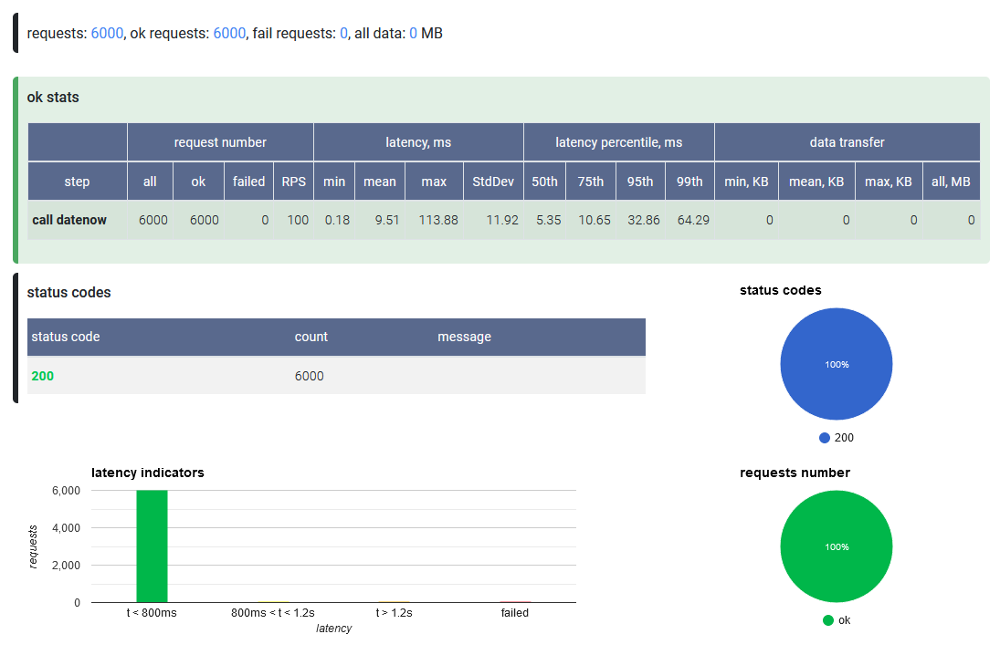

# NBomber как альтернатива JMeter для .NET разработчика
Как и многие разработчики, впервые столкнувшиеся с нагрузочным тестированием, я начал с JMeter. Для ознакомления и простых сценариев JMeter полностью меня устраивал, но с усложнением задач и потребностью в большем контроле я начал задумыватся о поиске более удобной альтернативы. Особенно хотелось чтобы инструмент легко адаптировался или уже был адаптирован под экосистему .NET.

В этой статье мы рассмотрим NBomber как легкую для освоения альтернативу JMeter, а также постараемся ответить на вопрос "Почему я должен проводить нагрузочное тестирование именно с NBomber ?".

Эта статья предназначена для .NET разработчиков, которые хотят пополнить свой инструментарий удобным инструментом для нагрузочного тестирования, а также тем кто рассматривает альтернативы JMeter для экосистемы .NET.

## JMeter как самый популярный инструмент для нагрузочного тестирования
JMeter, согласно статистике Google, является самым популярным инструментом для нагрузочного тестирования. Он имеет как графический так и консольный пользовательский интерфейс, богатый функционал, позволяющий выполнять практически любые задачи, а многие годы активного использования сформировали огромное количество материалов, в которых вы найдете ответ практически на любой вопрос. Это в теории, но что же на практике ?

Мне приходилось применять JMeter для простых сценариев на коммерческих а также на пет-проектах. Для выполнения простых задач с помощью JMeter достаточно посмотреть несколько видеороликов рассказывающих о пользовательском интерфейсе. После этого, немного попрактиковавшись, вы сможете довольно быстро писать простые сценарии и выполнять одноразовые и многоразовые задачи по стресс тестированию HTTP endpoint-ов. Однако, как это часто бывает, с усложнением задач появляются нюансы.

## Что побудило меня задуматся об альтернативе ?
Уверен что JMeter на самом деле способен решить если не все, то большинство задач, которые могут возникнуть в рамках нагрузочного тестирования. Вопрос только в том сколько вы готовы потратить времени на изучение документации и насколько критичен для вас вопрос удобства.
Хотелось бы сразу отметить что все сказанное далее в отношении JMeter крайне субьективно и можно легко списать на лень автора :)

### UI
Начать хотелось бы с того, что поначалу можно считать плюсом JMeter - с пользовательского интерфейса. Если простые сценарии можно решить в несколько кликов, то для доступа к чуть более продвинутым функциям вам скорее всего придется потратить некоторое время на изучение материалов из интернета. А так как обычно JMeter это не тот инструмент, который используется ежедневно, вы рискуете потратить это время не единожды.

Также для решения некоторых задач, например для авторизации с JWT, вам придется почти что [программировать с помощью UI](https://www.redline13.com/blog/2018/05/test-rest-apis-authentication-using-jmeter/). Сначала заполните форму для обьявления переменной, после форма для извлечения переменной из ответа от auth/token, далее вам необходимо заполнить форму для следующего запроса, в котором эту переменную вы сможете использовать и так далее.

### Зависимость от других инструментов
Сложный и непривычный UI может сподвигнуть вас искать более простое решение ваших проблем с помощью привычных инструментов. Например в JMeter имеются встроенные функции для генерирования случайных данных, которые позже можно использовать в запросах. Наверняка с их помощью можно сконфигурировать JMeter таким образом, чтобы он генерировал случайные данные нужного вам формата для каждого запроса. Однако мне, как .NET разработчику, проще программировать на языке C#, поэтому я часто предпочитаю писать код генерации данных на C#, сохранять данные в CSV и позже использовать в JMeter с помощью более простой функции подключения источника данных. Таким образом JMeter становится для меня не самодостаточным инструментом.

### Повторное использование и разработка в команде
У вас наверняка возникнет желание сохранить созданный сценарий в системе контроля версий для повторного использования в рамках проекта, чтобы и другие разработчики имели к нему доступ. Также система контроля версий позволит контролировать изменения, вносимые в конфигурацию другими членами вашей команды. Звучит неплохо, не правда ли ? Однако на практике JMeter сохраняет сценарии в формате XML и вряд ли кто то захочет его читать. Будет сложно определить что содержит ваш сценарий, а вы не сможете выяснить какие изменения в него хочет внести ваш коллега, пока вы не загрузите и не откроете файл в JMeter. Это немного ограничивает полезность сохранения файла конфигурации в системе контроля версий.

### Интеграция с CI
В рамках работы над одним из пэт-проектом я создал сценарий для нагрузочного тестирования и хотел изучить возможность автоматического запуска стресс теста в рамках ночного запуска тестов. Отлично, JMeter ведь поддерживает консольный интерфейс ! Однако он мне показался не намного дружелюбнее UI и желание продолжать изучение у меня на время пропало:


## Что такое NBomber ?
Перед тем как мы рассмотрим как NBomber проявит себя в похожих сценариях, нужно сделать небольшое введение. 

NBomber это C# библиотека с открытым исходным кодом, поставляемая через NuGet, которая содержит набор абстракций и утилит для написания сценариев нагрузочного тестирования с помощью C#. NBomber берет на себя управление потоками, регулирование нагрузки и сбор статистики, позволяя вам сконцентрироватся на сценарии теста. По своей сути NBomber чем то напоминает BenchmarkDotNet для полноценного нагрузочного тестирования.

После ознакомления с [документацией](https://nbomber.com/docs/overview) давайте напишем простой сценарий чтобы наглядно продемонстрировать отличный от JMeter подход к работе. Задачи, которые будет выполнять этот сценарий аналогичны выполнению простого сценария в jMeter:
- конфигурирование числа пользователей, нагружающих HTTP endpoint
- генерация расширенной статистики по среднему времени обработки запроса, RPS (request per second) и проценту ошибок
- генерация отсчета в разных форматах, включая графики и диаграмы

Код сценария: 
```csharp
using NBomber.Configuration;
using NBomber.Contracts;
using NBomber.CSharp;

using var httpClient = new HttpClient();
httpClient.BaseAddress = new Uri("http://localhost:5116");

var callDateNowStep = Step.Create("call datenow", async (context) =>
{
    var response = await httpClient.GetAsync("datenow");
    if (response.IsSuccessStatusCode)
        return Response.Ok(statusCode: (int)response.StatusCode);
    else
        return Response.Fail(statusCode: (int)response.StatusCode);
});

var scenario = ScenarioBuilder.CreateScenario("Call DateNow Api", callDateNowStep)
    .WithWarmUpDuration(TimeSpan.FromSeconds(10))
    .WithLoadSimulations(
        LoadSimulation.NewInjectPerSec(_rate: 100, _during: TimeSpan.FromMinutes(1))
    );

NBomberRunner
    .RegisterScenarios(scenario)
    .WithReportFormats(ReportFormat.Html, ReportFormat.Md)
    .Run();

Console.WriteLine("Press any key ...");
Console.ReadKey();
```

На мой взгляд, код получился достаточно лаконичным и понятным. Его можно хранить в [системе контроля версий](https://github.com/MrPomidor/NBomberDemo/blob/master/Solution/Cases.CallDateNow/Program.cs), что уже является преимуществом. Однако не будем торопиться и посмотрим на результат выполнения, статистику и графики. Запуская приложение в консоли, NBomber предоставит хорошо оформленную статистику выполнения в виде таблицы.


Выбрав в конфигурации формат отсчета html, в папке reports нам будет доступна страница, которая содержит красиво оформленную и детальную статистику по сценариям а также различные графики, упрощающие восприятие информации.



На данном этапе NBomber уже показывает себя как альтернатива JMeter для простых сценариев. Давайте попробуем еще больше раскрыть его потенциал, показав то, чего с помощью JMeter будет достичь немного сложнее.

## NBomber как альтернатива JMeter
Рассмотрим три задачи, которые наверняка могут возникнуть при нагрузочном тестировании HTTP API.

### Запрос с переменным количеством параметров
**Задача**: необходимо протестировать HTTP endpoint, который принимает в query string массив значений в формате "?myParameter=value1&myParameter=value2". Ваш csv файл с тестовыми данными содержит 3 колоноки. Каждая строка может содержать до 3-х значений.

Решение с помощью JMeter в лоб подразумевает использование вкладки Parameters для элемента "HTTP Request". Обьявляем 3 параметра, которые будут читать значения из 3-х переменных (каждая переменная отвечает за одну колонку). 


Запускаем тест и .... получаем BadRequest. 

```csharp
app.MapGet("/daysAgo", (StringArray myParameter) =>
{
    if (myParameter.Array.Any(x => string.IsNullOrEmpty(x)))
        return Results.BadRequest();
    ...
});
```

Проблема в том что элемент "HTTP Request" при пустом параметре не удаляет его из строки запроса, а наш тестовый API endpoint не пропускает пустые строки:


Решается ли задача с помощью JMeter ? Да? Но уже [другим способом](https://loadium.com/blog/how-to-add-a-variable-number-of-parameters-in-apache-jmeter), для нахождения которого вы потратите определенное время и этот способ скорее всего будет включать в себя написание скриптов на Java, Groovy или JavaScript.

При использовании NBomber вы сможете достаточно быстро решить проблему, просто переписав логику формирования query string на более привычном вам языке:

```csharp
private static string GetQueryString()
{
    var parametersCount = Random.Shared.Next(0, 3);
    if (parametersCount == 0)
        return string.Empty;
    var parametersString = "?";
    for(int i =0; i< parametersCount-1; i++)
    {
        if (i != 0)
            parametersString += "&";
        parametersString += $"myParameter={DateTime.Now}";
    }

    return parametersString;
}

var callDateNowStep = Step.Create("call daysAgo", async (context) =>
{
    var queryString = GetQueryString();
    var response = await httpClient.GetAsync($"daysAgo{queryString}");
    ...
});
```

### Генерация параметров запроса
**Задача**: необходимо протестировать HTTP endpoint, котрый кеширует ответы для некоторых входящих значений. Для решения этой проблемы вам нужны разные значения для каждого запроса.

JMeter имеет несколько [встроенных функций](https://jmeter.apache.org/usermanual/functions.html) такие как `Random`, `RandomDate`, `RandomString`, `UUID`. Этого может не хватить, если входящие данные должны быть определенного формата, например имя, электронная почта, номер телефона и так далее. Есть как минимум два варианта решения в рамках JMeter: использовать внутренний скриптинг, или использовать сторонний источник данных. Первый вариант требует определенных знаний и подготовки, а второй подразумевает использование стороннего сервиса или самописного приложения для генерации данных.


Используя NBomber вы получаете несколько преимуществ. Помимо использования привычного вам языка программирования вы также получаете возможность использовать популярные библиотеки для генерации тестовых данных, таких как [Bogus](https://github.com/bchavez/Bogus) или [AutoBogus](https://github.com/nickdodd79/AutoBogus).

```csharp
internal class User
{
    public string FirstName { get; set; }
    public string LastName { get; set; }
    public string Email { get; set; }
}

[Fact]
public void GenerateUser()
{
    var user = AutoFaker.Generate<User>();
    
    Assert.NotEmpty(user.FirstName);
    Assert.NotEmpty(user.LastName);
    Assert.NotEmpty(user.Email);
}
```

Более того, у вас появляется возможность, которая может быть неочевидной с первого взгляда: если вы храните ваши нагрузочные тесты в репозитории проекта, то вы можете использовать код доменной логики вашего приложения или переиспользовать код для генерации данных из уже имеющихся юнит тестов. Просто добавьте нужные ссылки в NBomber проект.

Возможно ли решить данную задачу с помощью JMeter ? Да. Удобно ли это ? Решать вам. NBomber в данном случае позволяет вам уменьшить количество используемых инструментов на проекте, позволяет использовать привычные библиотеки и даже переиспользовать код вашего приложения, чтобы решить задачу эфективно. 

### CI quality gate
**Задача**: в набор quality gates сценариев, которые запускаются каждый день в полночь, необходимо добавить сценарий, проверяющий что развернутое приложение выдерживает определенный RPS и среднее время ответа не превышает установленное значение. Сценарий должен работать как fail/pass. При fail подразумевается дополнительное расследование с помощью других более детальных тестов.

Сразу ответим на вопрос, можно ли выполнить эту задачу с помощью JMeter? Да! Есть множество способов интегрировать JMeter в ваш CI pipeline, и вы наверняка найдете подходящий вам по удобству и затратам способ (например [тут](https://schoeffm.github.io/posts/integration-of-loadtests-within-jenkins-pipelines/) или [тут](https://www.jenkins.io/doc/book/using/using-jmeter-with-jenkins/)). Давайте сразу рассмотрим предоставляет ли NBomber более удобный способ решения данной задачи.

Возьмем код рассматриваемого ранее примера с тестированием "/datenow" endpoint-а. Метод `NBomber.Run` возвращает обьект, который содержит статистику вашего нагрузочного сценария. Эти данные используются во время вывода на консоль и во всех отсчетах. Получив прямой доступ к этому обьекту, вы легко можете использовать статистику по интересующим вам шагам (шаги авторизации, например, можно отфильтровать) и построить простой assert. Если условие выполнено - приложение завершается с кодом 0, что значит тест пройден. Если условие не выполнено - консольное приложение вернет -1, что будет сигналом что тест провален.

```csharp
var stats = NBomberRunner
    .RegisterScenarios(scenario)
    .Run();

var stepStats = stats.ScenarioStats[0].StepStats[0].Ok;

var rpc = stepStats.Request.RPS;
var meanRequestTimeMs = stepStats.Latency.MeanMs;

if (rpc >= 90 &&
    meanRequestTimeMs <= 200)
{
    return 0;
}
else
{
    return -1;
}
```

После вам нужно лишь скомпилировать код в исполняемый файл и добавить его в ваш CI как отдельный шаг. Для данного конкретного сценария, на мой взгляд, быстрее, проще и удобнее использовать NBomber.

## NBomber как часть инструментария разработчика в экосистеме .NET

### Запуск сценария нагрузочного тестирования из IDE
Решение типовых задач выше дает представление об NBomber как о standalone инструменте для нагрузочного тестирование. Но что если вы хотите плотнее интегрировать NBomber в ваш процесс разработки и запускать его не только как standalone приложение, а как часть ваших интеграционных тестов в Visual Studio или Rider ?

Для написания теста нам необходимы части arrange, act и assert. `NBomber.Run` будет использоваться как act, а возвращаемый этим методом обьект статистики поможет нам написать assert. Но как нам написать arrange чтобы NBomber мог тестировать наше приложение из интеграционного теста без развертывания ? 

APS NET предоставляет удобный способ интеграционного тестирования вашего API с помощью класса `WebApplicationFactory` из пакета `Microsoft.AspNetCore.Mvc.Testing`. Этот класс используя `Program.cs` создает экземпляр вашего приложения в памяти и вы можете обращаться к нему, создав `HttpClient` с помощью метода `CreateClient()`. Для того чтобы трансформировать наш standalone NBomber сценарий с endpoint-ом "/datenow" в xUnit интеграционный тест, нам всего лишь нужно заменить экземпляр `HttpClient`, на тот что возвращает `WebApplicationFactory`.

```csharp
internal class DateNowWebApplicationFactory : WebApplicationFactory<Program> { }

[Fact]
public void DateLow_RPS_And_MeanMs_ShouldMatchRequirement()
{
    // arrange
    const int ExpectedRCP = 90;
    const int ExpectedMeanMs = 200;

    using var application = new DateNowWebApplicationFactory();
    using var client = application.CreateClient();
    var nBomberScenario = ScenariousHelper.GetDateNowTestScenario(client);

    // act
    var runStatistics = NBomberRunner
        .RegisterScenarios(nBomberScenario)
        .WithoutReports()
        .Run();

    // assert
    var stepStats = runStatistics.ScenarioStats[0].StepStats[0].Ok;
    Assert.True(stepStats.Request.RPS >= ExpectedRCP, "RPC is below expected");
    Assert.True(stepStats.Latency.MeanMs <= ExpectedMeanMs, "Mean request execution time above expected");
}
```

Стоит учитывать несколько важных деталей касательно использования данного подхода при тестировании. Cтоит учесть что результаты данного теста будут зависеть от машины, на котором он будет запускатся. От разработчика к разработчику железо может сильно отличатся, а CI машина или тестовый полигон вовсе могут быть калькуляторами. Также стоит учесть что данный подход тестирует ваше приложение in-memory, а значит что данный тест не будет учитывать network latency и при запуске standalone версии теста результаты могут оличаться. Это ограничивает применение данного подхода для полноценного нагрузочного тестирования, однако в процессе разработки тест скорее всего будет иметь другое назначение. 
Во-первых, данный тест будет полезен для оценки производительности определенного ендпоинта перед его релизом. Для оценки нам не нужны точные данные, нам лишь достаточно сказать что "данный ендпоинт приблизительно сможет обрабатывать 1000 запросов в секунду со средним временем ответа 200 миллисекунд".
Во-вторых, наличие данного теста поможет получить быструю обратную связь при рефакторинге и оптимизациях производительности. Разработчику перед началом изменений необходимо запустить тест чтобы получить исходный результат, а после сравнить его с новой версией кода, чтобы подтвердить улучшение производительности или отсутствие деградации перед развертыванием кода в тестовую среду.

### Запуск нагрузочного тестирования через dotnet cli
Можем ли мы адаптировать описанный выше подход для запуска полноценных нагрузочных тестов с помощью команды `dotnet test` ? Да ! Для этого нам необходимо всего лишь заменить вызов in-memory екземпляра на вызов развернутого в тестовой среде приложения через `HttpClient`, конфигурацию к которому мы будем хранить в `appsettings.json`. Изменения в коде при этом минимальны:

```csharp
private HttpClient CreateClient()
{
    var configuration = new ConfigurationBuilder()
        .AddJsonFile("appsettings.json")
        .Build();

    var baseUrl = configuration.GetValue<string>("BaseUrl");
    if (string.IsNullOrEmpty(baseUrl))
        throw new ArgumentException("Cannot read configuration");

    var httpClient = new HttpClient();
    httpClient.BaseAddress = new Uri(baseUrl);
    return httpClient;
}
```


## Итоги
В этой статье я хотел представить NBomber для тех кто еще не был с ним знаком а также показать его применение в типовых сценариях нагрузочного тестирования в сравнении с самым популярным на данный момент инструментом JMeter. Также мы рассмотрели возможности более тесной интеграции NBomber в процесс разработки приложения на C# и некоторые сценарии, например интеграционное тестирование в Visual Studio, для которых JMeter вам точно не подойдет. Примеры к этой статье доступны [по этой ссылке](https://github.com/MrPomidor/NBomberDemo). Сразу хочу отметить что представленный там код не является на 100% правильным согласно документации NBomber, например я намеренно не использовал DataFeed и ClientFactory чтобы код оставался максимально простым и доступным. Вы можете ознакомится с полным набором возможностей NBomber и его документаций на [сайте проекта](https://nbomber.com/).

На мой взгляд, NBomber имеет шанс занять место в вашем инструментарии как удобный инструмент для проведения нагрузочных тестов. Он легко адаптируется в процесс разработки на C#, открывает возможности к повторному использованию части вашего кода, позволяет использовать привычную вам среду разработки, язык и библиотеки, легко интегрируется в CI и в целом способен заменить JMeter для многих сценариев. Надеюсь что статья была вам полезна.

Спасибо за внимание !

Антон Широких